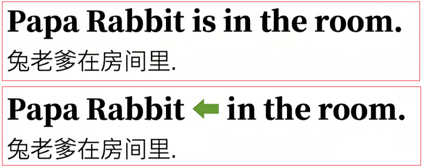
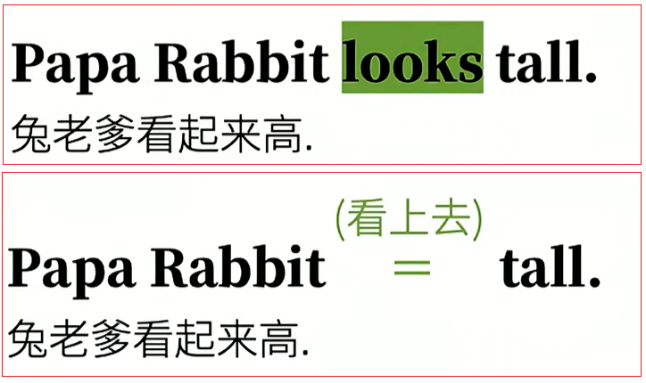
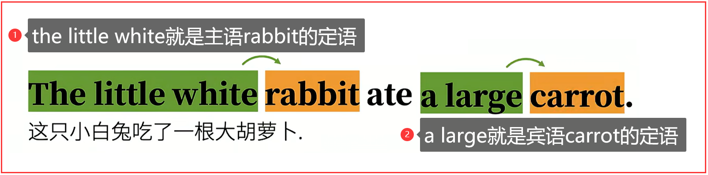
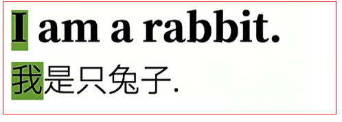
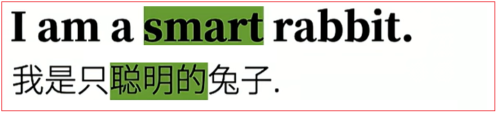
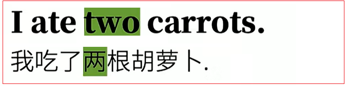
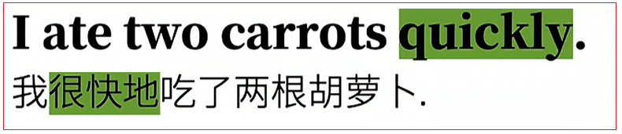
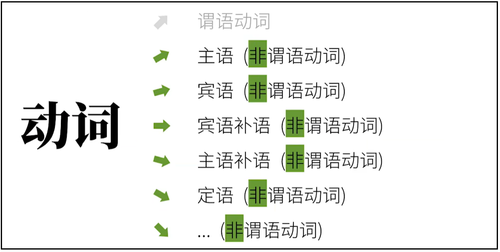

# 1.英语语法体系

## 1.1.英语句子简介

所有的英语语法只有一个目的：造句

英语和中文一样，说话写文章有时用短句子，有时间用长句子，不同的短句子又可以组合成新的长句。但是这里长句并不适合语法讨论。把长句子拆开来，直到句意完整的最简单的句子，也就是基本句，才好研究其语法。我们称其为<font color=red><strong>简单句（Simple Sentences）</strong></font>。

除去"嗯！"，"哦"，"啊！"这样的感叹句、省略句、向整句提问的问句。简单句都是全部都是在说"什么怎么样"。

绝大多数句子粗略地分为两个部分。<font color=red><strong>什么+怎么样，而"什么"+"怎么样"分别对应了两个最基本的"句子成分"。</strong></font>（"句子成分"，clause elements，是个语法概念。）


<font color=red><strong>两个最基础的句子成分是"主语（subject）"和"谓语（predicate）"，换句话说几乎所有的英语句子的结构都属主语+谓语。</strong></font>

<strong>主语（subject）：这里主语一般是人或物，不管抽象还是具体。</strong>

<strong>谓语（predicate）：这个怎么样都有一个广义的"动作/发生了什么事儿"。注意：这个"动作"并不是我们平时狭义说的要"动起来"的"动作"。</strong>

而这个广义的"动作"也就是我们语法上说的"动词（verbs）"。

## 1.2.基本句型

那么有哪些不同类型的"动作"呢？

### 1.2.1.可以独立完成的动作

<font color=red>句子结构：主语+<strong>不及物动词</strong></font>


**这样没有承受着的动作叫做"不及物动词（intransitive verbs）"。**

### 1.2.2.有1个动作的承受者

<font color=red>句子结构：主语+<strong>单及物动词</strong>+宾语</font>


**如果只说"兔老爹喜欢"，肯定觉得句子不完整。因为像"喜欢"这样的动词没有承受着就没有什么实际意义，这样的动词属于"及物动词（tansitive verbs）"。而这个动词的承受者就是宾语（object）。**

### 1.2.3.有2个动作承受者

<font color=red>句子结构：主语+<strong>双及物动词</strong>+间接宾语+直接宾语</font>


**这里的核心动词时teach(教)。但是教授的知识是英语，而知识的接受对象是你。在语法上，把这样两个动词的两个承受着分别称为：直接宾语（direct object）和间接宾语（indirect object）。**

**如果只说"兔老爹教英语"，其实语义已经完整了，因为句中英语就是直接宾语。而如果只说"兔老爹教你"，没有上下文的话，肯定觉得缺少什么，所有"你"在句中是间接宾语。**

**这样既有直接宾语又有间接宾语的动词，也是及物动词的一种，更具体的说，他属于双及物动词（ditransitive berbs）。**

### 1.2.4.只有1个动作承受者（但需要补充）

<font color=red>句子结构：主语+<strong>复杂及物动词</strong>+宾语+(宾语)补语</font>


<strong>这里虽然只有一个动作承受者，也就是宾语，"你"。</strong>

<font color=red><strong>但是如果只说"兔老爹认为你"，肯定觉得话没有说完，可是宾语"你"后面的聪明，却不像第三种情况那样是另一个动作承受者。这样的动词必须要有补充承受者的信息才意义完整，而这个补充的信息语法上称为补足语，或者补语（complement）。更明确也可以说是宾语补语（object complement）。</strong></font>

<strong>这样需要补语的动词，我们称之为复杂及物动词（complex-transitive Verbs）。</strong>

### 1.2.5.非"动词"

<font color=red>句子结构：主语+<strong>系动词</strong>+（主语补语）/表语</font>

1. 该动作所表达的"动作"和咱们狭义说的"动作"不太一样。如Papa Reabbit is tall,这个is在中文里经常翻译为"是"。is这样的词为代表的一类词，但它实际上的作用其实很简单，就是把这个动词之后的属性信息赋予给前面的主语。

   

   is的作用就是把Papa Rabbit和tall连在一起，把后者属性信息赋予前者。

2. 如果把tall换成in the room(在房间里),即Papa Reabbit is in the room,其实就是把in the room这个状态性质赋予给Papa Rebbit而已。

   

3. 再看Papa Rabbit looks tall。这个look通常一样是"看"，但是这里到底是谁看？其实不是兔老爹在看，兔老爹在这里是被看。
   这句话的意思是"兔老爹看上去高"，其实也是把动词后面的tall赋予给动词从前面的主语Papa Rabbit而已。只不过比之前的is多了个"看上去"的意义。

   

   例如Papa Rabbit smells nice，兔老爹闻上去香，其实还是把香属性赋予主语Papa Rabbit，只不过还有"闻上去"的这层意思。

   <font color=red><strong>像这样的赋予主语某种性质状态的动词，我们称之为连系动词，也被称为系动词（link verbs）</strong></font>

   <font color=red><strong>而系动词后面的补充信息也自然是补足语（补语），更精确点可以说是主语补语，而主语补语在中国英语教学体系中还有另一个名字叫做表语（predicative）。</strong></font>

### 1.2.6.补充句型

*注:还有一种"八大句型"的分类,即在"五大句型"基础上增加:

1. "there be"句型,如:There is a rabbit.可理解为第五种句型"主语＋系动词＋表语"的倒装.
2. 主语+谓语动词+状语,如:l live in China.可理解为第一种句型"主语+谓语动词"的延伸(虽然这里的状语很重要).
3. 主语+谓语动词+宾语+状语,如:l put the carrot on the table.可理解为第四种句型""主语＋谓语动词＋宾语＋宾语补语"的延伸。

### 1.2.7.总结

英语中的所有句子，当拆到不能再拆后，都是在说：什么 + 怎么样；什么是语法上的主语，怎么样是语法上的谓语。谓语都有一个核心动词，叫做谓语动词。
谓语动词有五个基本类别:


所谓的主谓宾，只不过是上面的一个类别（第二个），主语+谓语动词+宾语，也就是所谓的"主谓宾结构"。严格来说谓语和谓语动词是有区别的。


<font color=red>**句子主语后面余下句子部分就是谓语,谓语动词只是谓语动词的一部分。**</font>


<font color=red>**但是在平时，通俗地，为了方便，很多人会直接称呼谓语动词为谓语。**</font>


<font color=red><strong>而把"主语"，"谓语动词"，"宾语"这样的句子结构，直接称呼为"主语"，"谓语"，"宾语"。现在之所以强"调谓语动词"的概念。因为后面要提到"非谓语动词"的概念。</strong></font>

## 1.3.句子成分

### 1.3.1.前面主要设置的句子成分

1. 主语
2. 谓语动词
3. 宾语
4. 宾语补语
5. 主语补语（表语）

### 1.3.2.句子成分的补充

#### 1.3.2.1.定语（Attrbute）

<font color=red><strong>主要用于修饰主语或者宾语</strong></font>

示例：



#### 1.3.2.2.状语（Adverbial）

<font color=red><strong>主要用于修饰谓语动词</strong></font>

示例：


#### 1.3.2.3.同位语（Appositive）

<font color=red><strong>主要用来再把主语或者宾语说一遍</strong></font>

示例：


### 1.3.3.句子成分总结


到目前位置，我们所说的都是简单句，即没法拆分的句子。可是我们说话写文章可不是全是简单句，我们实际中说话或是写文章会把这些不同的简单句互相组合。形成所谓<font color=red><strong>Compound Sentences</strong></font>和<font color=red><strong>Complex Sentences</strong></font>。

#### 1.3.3.1.Compound Sentences(复合句)


**Compound Sentences**：说白了就是句子简单地叠加，是并列关系，直接翻译为"复合句"，有点语法书是"并列句"。

#### 1.3.3.2.Complex Sentences(复杂句/从句)


**Complex Sentences**：是将一个句子套在另一个句子里，甚至一个句子还能再套一个句子……一直套下去……这是一种从属关系。complex sentences直接翻译为"复杂句"。有些语法树居然会用"复合句"（其实对应的是compound sentences）这个术语，造成了很多人的混乱。

在这里，一个句子套另一个句子，在英语语法上分别叫做主句（main clause）和从句（subordinate clause）。


从句就是把简单句修改一下来充当另一个句子的句子成分。


#### 1.3.3.3.从句的类别


## 1.4.词性（词类）

### 1.4.1.词性间接

两个句子也许句子组成的方式相同。

主语	+ 谓语动词	+ 宾语

比如都是主语+谓语动词+宾语，可是句中包含词的类型并不一定相同。

例如：


### 1.4.2.词性的分类

很显然，两者这两句话"句型"相同，但是包含的词却不一样。也就是说，同意类句子成分里可能有不同的词类。这个概念中文也有，语法中的词性（parts of speech）包括：

#### 1.4.2.1.名称（noums），表人和物。


#### 1.4.2.2.冠词（articles），英语中说明人和事物


#### 1.4.2.3.代词（pronouns），代替人和物



#### 1.4.2.4.形容词（adjectives），形容人和物



#### 1.4.2.5.数词（numerals)，表数量



#### 1.4.2.6.副词（adverbs），修饰动作或者形容词，等等。



#### 1.4.2.7.介词（prepositions），表示和其他词关系的词


#### 1.4.2.8.叹词（interjections）表感叹


#### 1.4.2.9.连词（conjunctions），连接词和句


### 1.4.3.总结

<font color=red><strong>以上这写词和着重讲的动词一起，就是英语的十大词类。句子成分和句子中的词类是完全不同的概念。</strong></font>


<font color=red><strong>这里面每一种句子成分，除了谓语动词是动词，其他都有可能包含不同的词类。句子成分中最特殊的似乎就是谓语动词这一类。其他句子成分可能是不同词类，但是谓语动词显然只能是动词。</strong></font>


## 1.5.谓语动词

### 1.5.1.谓语动词简介

英语谓语动词有些很厉害的本领，而这些本领是中文词都没有的，所有是英文语法难点之一。

### 1.5.2.谓语动词三大本领

谓语动词有中文动词没有的"三大本领"：

#### 1.5.2.1.本领一：动作<font color=red><strong>时</strong></font>间

比如动作可能在过去或者将来。

#### 1.5.2.2.本领二：动作状<font color=red><strong>态</strong></font>

<font color=red><strong>以上两种合在一起称为时态。英语的时态就是时间+状态合在一起。而并非只有时间。</strong></font>

1. 动作<font color=red><strong>时</strong></font>间

   比如动作可能在过去或者将来。

2. 动作状<font color=red><strong>态</strong></font>

   比如动作可能已经完成的状态或者正在进行的状态

#### 1.5.2.3.英语的时态

<font color=red><strong>以上动作时间和动作状态两种合在一起称为时态。英语的时态就是时间+状态合在一起。而并非只有时间。</strong></font>


英语描述动作时间是4种：

1. 现在
2. 过去
3. 将来
4. 过去将来

英语描述动作状态是4种：

1. 一般
2. 完成
3. 进行
4. 完成进行

而动词的4种时间和4种状态自由排列组合。


#### 1.5.2.4.本领三：动作假设、情感……

这个叫做动词的语气（和我们平时说话的那个"语气"不是一个"语气"；这里是语法的"语气"）。

比如


#### 1.5.2.5.总结

以上三个概念在专业术语中称为动词（Verb）的Tense、Aspect、Mood，合称为TAM……。中文往往会译成时、体、气


### 1.5.3.助动词（auxiliary verbs）

<font color=red><strong>英语的谓语动词本身往往是不能够独立完成刚才说的那些三大本领，以及一些其他的本领。</strong></font>

<font color=red><strong>而且谓语动词独自也无法完成比如表示否定、可能性、必须性等意思。想让谓语动词充分发挥功能，我们必须用到另一类经常和动词一起用的词，帮助"完成任务"。他们就是"助动词"（auxiliary verbs）。</strong></font>

比如eat（吃）谓语动词。

1. 为了协助它表示<font color=red><strong>"吃过了"，完成的状态。</strong></font>就需要用到助动词<font color=red><strong>have；e.g：hava eaten.</strong></font>
2. 为了协助它表示<font color=red><strong>"正在吃"，进行的状态。</strong></font>就需要用到助动词<font color=red><strong>be；e.g：is eating.</strong></font>
3. 为了协助它表示<font color=red><strong>"被吃"，被动的状态。</strong></font>就需要用到助动词<font color=red><strong>be；e.g：is eaten.</strong></font>
4. 为了协助它表示<font color=red><strong>"有能力吃"，</strong></font>就要用到助动词<font color=red><strong>can；e.g：can eat.</strong></font>
5. 为了协助它表示<font color=red><strong>"有可能吃"，</strong></font>就需要用到助动词<font color=red><strong>might；e.g：might eat.</strong></font>
6. 为了协助它表示<font color=red><strong>"有义务吃"，</strong></font>就需要用到助动词<font color=red><strong>must；e.g：must eat.</strong></font>
7. 为了协助表示<font color=red><strong>"不吃（否定）"，</strong></font>就需要用到助动词<font color=red><strong>do；e.g：do not eat.</strong></font>


**但是很多助动词特别喜欢伪装，他们处理做助动词(没有实义，只是帮助谓语动词而已)，还可以做实义动词，甚至其他词性。**

比如

- can还可以是"易拉罐"
- might可以是"力量"
- musty可以是"发霉的"
- do可以是"做某事"
- have可以是"拥有"
- be可以是"存在"

这些也恰恰是容易让人混乱的地方，所有千万不能把助动词和它其他身份（做实义动词时）弄混淆。

### 1.5.4.非谓语动词

谓语动词之所以叫做"**谓语动词**"，不能只叫"**动词**"。那是因为还有"**非谓语动词**"。

之所以这么叫时因为动词处理充当句子中的谓语动词，还有可能充当：主语、宾语、宾语补语、主语补语、定语，等。只不过需要把谓语动词修改一下，改成非谓语动词。


<font color=red><strong>非谓语动词几乎可以取代所有的从句，从而简化句子。只不过这样的动词就不再具有表示动作时间，状态，语态，语气的功能，也就是他们丧失了时态、语气、语态这些本领了。他们时以不同的形式出现在句中，包括：动词不定式、现在分词、动名词，过去分词。</strong></font>

但是存在的问题是:

1. 不定式长得和谓语动词原型一样，比如句中出现eat，并不能确定（如果没有上下文）它是谓语动词还是不定式，除非还有还有其他的词。
2. 现在分词和动名词长和谓语动词的进行状态一样，比如句中出现eating，并不能确定（如果没有上下文）是谓语动词进行中、还是现在分词、或是动名词。
3. 过去分词长得和谓语动词的完成状态一样，比如句中出现eaten，并不能确定（如果没有上下文）谓语动词完成了，还是过去分词。


**因此非谓语动词也是英语语法的一大难点。**

## 1.6.英语语法体系的主体框架

<font color=red><strong>英语语法的核心就是动词，动词能够串起几乎所有的语法概念。</strong></font>

用动词高度/粗略概括一下整个英语语法体系：


<font color=red><strong>英语的核心是动词，分为谓语动词和非谓语动词。</strong></font>

- 谓语动词

  1. <strong>谓语动词分为5种（不及物动词、单及物动词、双及物动词、复杂及物动词、系动词），分别决定了简单句（不能再拆）的5种基本句型。同时也囊括了句子：主语、谓语动词、宾语、宾语补语、主语补语（表语）。除此之外，句子成分还有：定语、状语、同位语。</strong>
  2. <strong>简单句可以组合并列关系的"复合句"以及从属关系的"复杂句"，复杂句包括主句和从句，从句可以充当所有除谓语动词外的句子成分。句子成分可以由不同的词充当，分别是名词、代词、冠词、形容词、数次、副词、介词、叹词、连词。</strong>
  3. <strong>谓语动词可以表达动作时间、状态、语气等，但是需要用到助动词（包含情态动词）。助动词还能帮助否定动词，表达动词的被动、可能性、义务性……</strong>

- 非谓语动词

  <strong>非谓语动词可以视为"被改动后的"谓语动词，可以充当除谓语动词外的所有句子成分，取代几乎所有从句，简化句子。</strong>

<font color=red><strong>以上就是英语语法体系的主体框架和说明。绝大多数语法和规则都逃不出这个框架，而无数的规则和特例也不敢让这个核心体系更加丰富而已。</strong></font>

## 1.7.动词分类

### 1.7.1.五大类谓语动词对应五大类句型


### 1.7.2.动词分类


分类详解：

1. <font color=red><strong>及物动词和不及物动词合起来就是"实义动词"（也可以叫做行为动词），因为这些动词都有实际意义，但是"及物"和"不及物"是实义动词按照"动作承受者"来分类的。</strong></font>

2. <font color=red><strong>如果按照"状态动作分类"，实义动词还可以分为"动作动词"和"状态动词"。</strong></font>

   - <font color=red><strong>动作动词：像eat(吃)明显就是动起来的动作动词</strong></font>
   - <font color=red><strong>状态动词：像have(有)、feel(感觉)、own(拥有)、believe(相信)</strong></font>

3. <font color=red><strong>(连)系动词，系动词是"连系"主语和主语补语（表语）。</strong></font>

   <font color=red><strong>也有体系把系动词算作在"不及物动词"里面的；</strong></font>

   <font color=red><strong>而系动词往往也可被视为"状态动词"</strong></font>

4. <font color=red><strong>实义动词和系动词可以做句子的谓语动词。</strong></font>

5. <font color=red><strong>另外还有"助动词"和"情态动词"--他们是不能独立作谓语动词的，而所谓"情态动词"往往也被是作"助动词"的一种。</strong></font>

6. <font color=red><strong>除了谓语动词，还有"非谓语动词",也叫"非限定性动词"。一个简单句只能有一个谓语动词，可以表达"时体气"等概念。</strong></font>

   

   <font color=red><strong>而句中其他动词必须以非谓语动词身份出现，无法表达"时体气"。</strong></font>

   


```html
<strong></strong>
<font><strong></strong></font>
<font color=red><strong></strong></font>
<font color=red> </font>