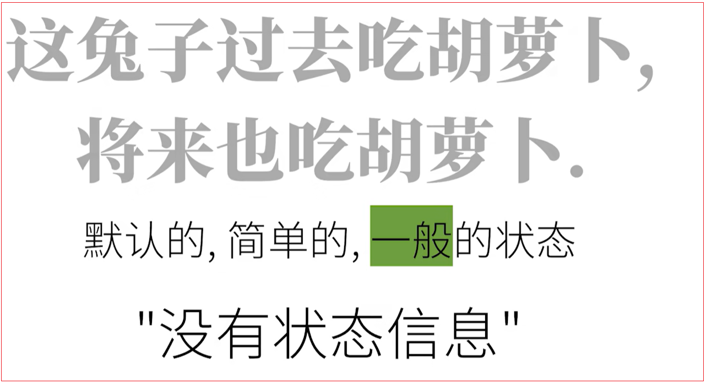
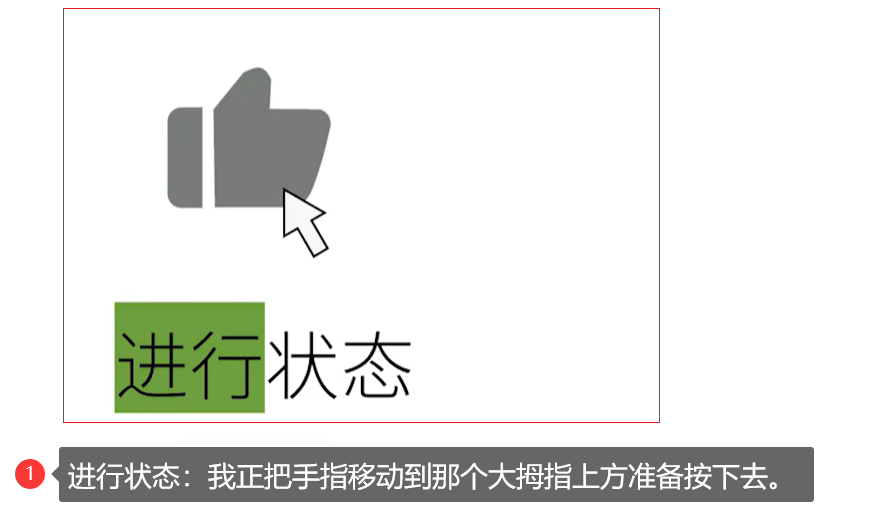
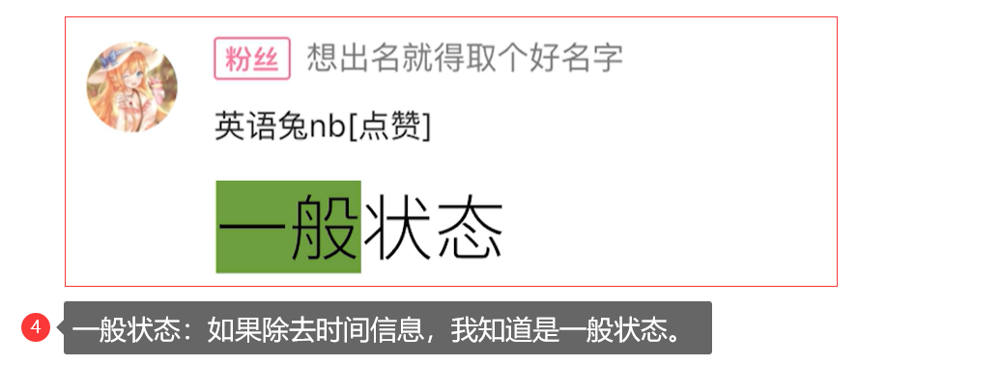
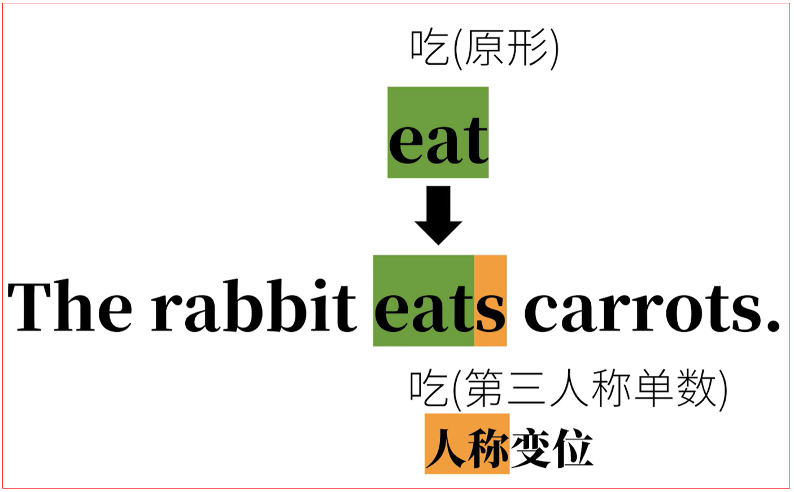
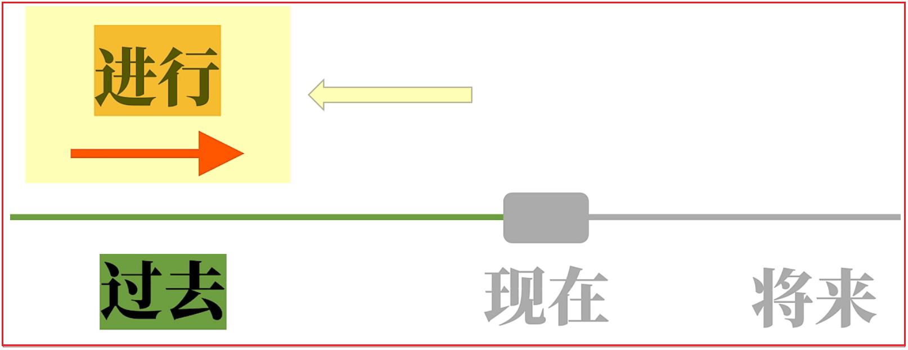
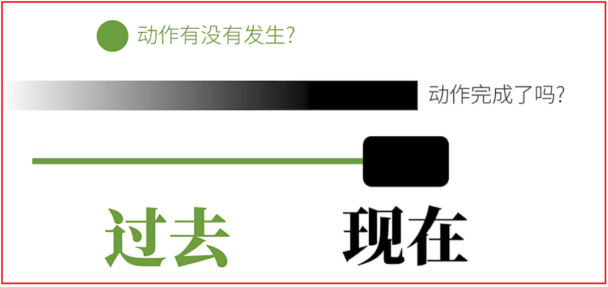
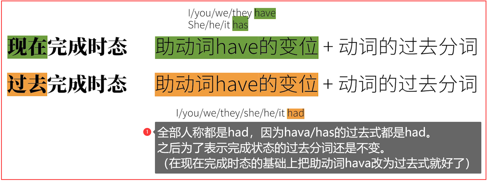
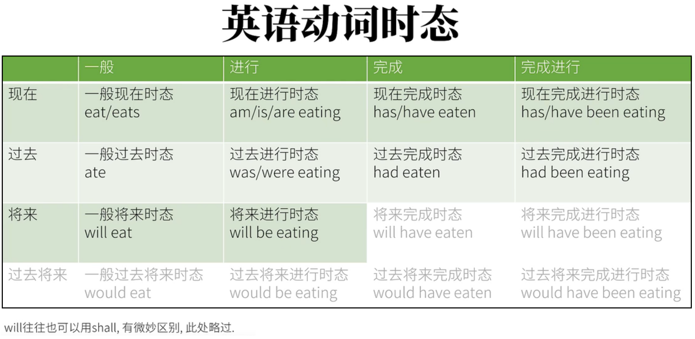

# 2.英语时态简介

<font color=red><strong>在之前的"语法体系综述"那个视频里，提到一个关键概念，那就是：英语的时态，或者更准确的说英语动词的时态，是动词的时间和动词的状态在一起，和称"时态"。</strong></font>


动词有4种时间，也有4种状态，自由排列组合便是理论上的16种时态。


因此先把时间和状态的概念搞清楚，然后再去具体讨论，用什么词去具体构成时态。

## 2.1.动词时间

### 2.1.1.现在、过去、将来

动词的时间前三种是<font color=red><strong>现在、过去、将来</strong></font>。对我们来说很好理解。


### 2.1.2.过去将来

<font color=red><strong>第四种是"过去将来"。过去将来，就是对于过去某一个时间点而言的将来。</strong></font>

比如**昨天是前天这个过去的将来**，如下图。


可是，**过去的将来和现在的关系就不一定了,比如昨天的后天是明天，是现在的将来**。如图：


也就是说<font color=red><strong>"过去的将来"和"现在"没有必然的关系</strong></font>。那么我们暂且把过去将来画成如下图。


也就是默认<font color=red><strong>"过去的将来"在"现在"的过去，但是这不是一定的，也有可能是过去的将来在未来的将来。</strong></font>如下。


这个过去将来时间在现实中不常见，一般只出现在从句中，而像"过去将来完成进行时态"这样的几乎不可见。

## 2.2.动词状态

动词的状态其实也不难理解，借助中文举例：

### 2.2.1.进行状态

**这兔子正在吃胡萝卜。**


<font color=red><strong>兔子这个吃胡萝卜的动作或者说过程正在进行中。</strong></font>

可以画图理解：


### 2.2.2.完成状态

**这兔子吃掉了胡萝卜。**


<font color=red><strong>胡萝卜已经在兔子肚子里了</strong></font>

<font color=red><strong>注意：完成态的重点在动作已经完成了，而并没有指出动作具体发生时间。咱们没法实际上标注动作的箭头的起点，不应该这样标注，因为不管在那种时间里，完成状态并不直接说明动作具体的开始时间。</strong></font>

可以画图理解：


### 2.2.3.完成进行状态

**这兔子从早上就开始吃胡萝卜，现在还没停呢。**


可以画图理解：


### 2.2.4.一般状态

没有特别指出的"默认的、简单的，一般的"状态。

这个"一般"状态在没有时间的帮助下，可能有那么一点难描述。

例如：



可以画图理解：


### 2.2.5.总结


之所以在这里拆开来其实主要还是以教学为目的。

举例：






## 2.3.时间+状态

### 2.3.1.现在时间


如果以现在时间点为参考点，那么现在的动作就有四种状态：

#### 2.3.1.1.现在进行时态（Present Progressive Tense）

<font color=red><strong>现在的，进行中状态</strong></font>


如：**这兔子现在正在吃胡萝卜**

#### 2.3.1.2.现在完成时态（Present Perfect Tense）

<font color=red><strong>对现在而言的，完成了的状态。</strong></font>


如：**兔子现在已经吃完了胡萝卜**

#### 2.3.1.3.现在完成进行时态（Present Perfect Progressive Tense）

<font color=red><strong>对现在而言，完成了的，但是接下来还会继续的状态。</strong></font>


**如这兔子已经吃完了一些胡萝卜，现在还要继续吃。**

#### 2.3.1.4.一般现在时态（Present Simple Tense）

<font color=red><strong>对现在而言，没有特别指出的状态。</strong></font>


如：兔子吃胡萝卜（或者兔子是吃胡萝卜的生物）

### 2.3.2.过去时间


#### 2.3.2.1.过去进行时态（Past Progressive Tense）

<font color=red><strong>过去，进行的状态。</strong></font>


如：**这兔子昨天下午3点那个时候正在吃胡萝卜**

#### 2.3.2.2.过去完成时态（Past Perfect Tense）

<font color=red><strong>对过去而言的，完成了的状态。</strong></font>


**如这兔子昨天下午3点那个时候已经吃完了胡萝卜**

#### 2.3.2.3.过去完成进行时态（Past Perfect Progressive Tense）

<font color=red><strong>对过去而言，完成了的，但是接下来还会继续的状态</strong></font>


**如兔子昨天下午3点那个时候已经吃完了一些胡萝卜，还要继续吃。（至于之后持续吃到什么时候，不得而知）**

#### 2.3.2.4.一般过去时态（Past Simple Tense）

<font color=red><strong>对过去而言，没有特别指出的状态。</strong></font>


**兔子过去吃（了）胡萝卜（只是单纯表示这个动作发生在过去而已）**

### 2.3.3.将来时间

#### 2.3.3.1.将来进行时态（Future Progressive Tense）

<font color=red><strong>将来的，进行中的状态。</strong></font>


如：**这兔子明天下午3点那个时候会正在吃胡萝卜。**

#### 2.3.3.2.将来完成时态（Future Perfect Tense）

<font color=red><strong>对将来而言的，完成了的状态</strong></font>


如：<strong>这兔子明天下午3点那个时候会已经吃完了胡萝卜（不知道什么时候开始吃的，有可能现在已经开始吃了，总之明天三点时候，肯定吃完了）</strong>

#### 2.3.3.3.将来完成进行时（Future Perfect Progressive Tense）

<font color=red><strong>对将来而言，完成了的，但是接下来还会继续的状态。</strong></font>


<font color=red><strong>这兔子明天下午3点那个时候，已经吃完了一些胡萝卜，还要继续吃（什么时候开始吃，什么时候结束吃，都不知道，总之明天3点那个时候已经吃了一段时间，而且还不停止）</strong></font>

#### 2.3.3.4.一般将来时态（Future Simple Tense）

对将来而言的，没有特别指出的状态。


**兔子将来吃胡萝卜（只是单纯表示这个动作会发生在将来而已）**

## 2.4.时态的4大难点

### 2.4.1.时间和状态未分清

学校里教时间和状态往往是"揉"在一起教，或者即使区分，往往也不特别指出，这就导致很多人脑中的时态混乱。

必须要理解实际和状态时怎么"合体"的。

### 2.4.2.动词变位

英语动词有"变位现象"，也就是单词的拼写往往会改变，隐喻时态的各种"时间"和"状态"的概念并不难理解，因为我们常用的中文也可以表达相同的概念。问题在于中文里表达时间的概念，只要加上描述时间的字眼就可以了，不需要对字本身做出改动。


汉字的写法在不同的时间状态里可不会改变。

<font color=red><strong>但是英语就不同了，表达不同的时态，不但往往要加表示时间的信息，还往往会对动词本身的拼写作出改动。</strong></font>

<font color=red><strong>比如：The rabbit ate a carrot。动词原形eat就要拼写为ate。这个就是动词的时态变位。</strong></font>


<font color=red><strong>即使在同一个时间。如在现在时间里，The rabbit eats carrots。动词原先要+s，这个术语动词的"人称变位"。</strong></font>



<font color=red><strong>再比如，am、is、are是动词be的现在时间里的人称变位；</strong></font>

<font color=red><strong>was，were是be在过去时间里的人称变位；</strong></font>

### 2.4.3.助动词

英语时态往往需要借助另一个种动词，也就是前面提到到助动词。而助动词不但有的时候出现有的时候不出现，而且往往和之后的实义动词一样，也要进行"动词变位"，所有又是"难上加难"。

比如，进行状态：


### 2.4.4.与其他语法概念混合

时态往往和其他语法概念和现象混在一起，所以算是更加难上加难。

比如：


## 2.5.一般现在时态

### 2.5.1.一般现在时态简介

<font color=red><strong>一般现在时态构成很简单，直接加动词原型，也就是动词在字典里的词条就行。</strong></font>

除了第三人称单数要在词尾加S。


比如：

1. I <strong><font color=green>eat</font></strong> carrots.
2. You <strong><font color=green>eat</font></strong> carrots.
3. We <strong><font color=green>eat</font></strong> carrots.
4. She <strong><font color=green>eat</font><font color=red>s</font></strong> carrots.
5. The rabbit <strong><font color=green>eat</font><font color=red>s</font></strong> carrots.

这个时态可以说是最"容易构成"的时态，但是，它反而是最容易出错的时态之一，最主要的原因是很多同学容易把"现在"时间和"一般"状态弄混淆。一看到"现在"俩字，有些人就本能觉得那一定是现在正在进行种的动作。

可是，I eat carrots可不是我"正在"吃胡萝卜的意思。一般现在时的"一般"可以理解为"默认的，并没有特别指出的动作状态"。所以反而不太可能是正在进行的动作。一般现在时这个时态主要用于三种情况：

### 2.5.2.一般现在时应用的情况

#### 2.5.2.1.表达事实

I eat carrot<font color=red><strong>s</strong></font>.

The rabbit eats carrot<font color=red><strong>s</strong></font>.

<font color=red><strong>这两句话中的carrots，使用复数，而且前面没有冠词，这是"泛指"胡萝卜的这类食物。</strong></font>

所以上面句子是事实称述：


还有

1. The sun rises in the east.太阳从东边升起.
2. The earth revolves around the sun.地球绕太阳转.

<font color=red><strong>这些都是事实，显然不适合用其他状态，所以用一般情况。而这样的事实情况，除了没有状态显示，也没有时间限制。</strong></font>

**易错分析**：

1. 把I eat carrot<font color=red><strong>s</strong></font>.把之前的carrots复数改为单数，即改为I eat a carrot。语法上似乎没有问题，可是表达意思不清楚。表达进行中的动作不用一般现在时态，而且胡萝卜也不能让你每天吃，所以这句话逻辑上就不对。
2. 如果对人说:I go to lunch.好像缺少信息。别人可能会反问：Do you mean you're going for lunch now?(你现在去吃午饭吗？)；如果加时间副词I go to lunch now.在英语里，还是听上去不对头，就是因为这里是一般现在时态，反而很少和"现在（now）"同时使用；而now往往和马上要讲到的<font color=red>**现在进行时态**</font>一起使用。

#### 2.5.2.2.表达习惯/重复的动作

比如：I play basketball.我打篮球（我有这个习惯）

<font color=red><strong>这里是习惯，所以不能用进行状态或者完成态，只能用一般态。</strong></font>

#### 2.5.2.3.表示预计发生的事

比如：The bus leaves at 8PM tonight.	公交车今晚八点离站.

其实也可以把这句话当作称述一个事实.也可以加一个时间，把它改为"习惯/重复动作"，如：The bus leaves at 8PM every day.

## 2.6.现在进行时态

### 2.6.1.现在进行时态简介


相当于中文"正在做某事"。

### 2.6.2.现在进行时态的构成


#### 2.6.2.1.助动词be

be这个动词有两个主要身份：

1. （连）系动词

   I am a smart rabbit	——>	I <font color=red><strong>= </strong></font>a smart rabbit.

2. 助动词，构成时态

   be的动词变位，也是就是改变拼写，为：

   - I	am
   - You/we/they   are
   - She/he/it     is

#### 2.6.2.2.现在分词

通常：+ing

如：looking(看)，smelling（闻），tasting（品尝）……

有些动词要在原来基础上改变拼写

1. write	—>writing，不是writeing
2. hit        —>hitting，不是hiting
3. die        —>dying，不是dieing

### 2.6.3.例句

I eat carrots

1. 第一人称

   改为现在进行时态就是：I am eating carrots	我正在吃(一些)胡萝卜.

   或者I am eating a carrot	我正在吃一根胡萝卜.

2. 其他人称

   You/we/they <font color=red><strong>are eating</strong></font> a carrot.

   She/he/it <font color=red><strong>is eating</strong></font> a carrot.

   The rabbit <font color=red><strong>is eating</strong></font> a carrot.	这兔子现在正在吃胡萝卜的过程中.

   You <font color=red><strong>are watching</strong></font> my vidio.		你现在处在看我的视频的过程中.

   I <font color=red><strong>am thinking</strong></font> of you.		我现在处在正想你的过程中.

## 2.7.现在完成时态

### 2.7.1.现在完成时态简介


<font color=red><strong>完成时态通常表达"已经"完成了的动作，往往还对现在造成影响。</strong></font>

比如我已经吃掉了胡萝卜（暗示：没得吃了）

中文是用"过"，"了"这些词来表示完成的，比如：我吃<font color=red><strong>过</strong></font>胡萝卜

### 2.7.2.现在完成时态的构成


#### 2.7.2.1.hava

1. <font color=red><strong>实义动词："有".</strong></font>

   我有些"硬币"给了这个视频. I hava some coins for this video.

2. <font color=red><strong>助动词，构成时态</strong></font>

   I/you/we/they 	<font color=red><strong>hava</strong></font> ……

   She/he/it		<font color=red><strong>has</strong></font> ……

#### 2.7.2.2.动词的过去分词

通常：+ed

如：looked（看），smell（闻），tasted（品尝）……

但是也有很多动词的过去分词，是所谓"不规则变化"，不是在词尾+ed那么简单。

有些动词是："不规则变化"，比如：


**补充**

<font color=red><strong>动词除了过去分词这种变位，还有一种变位叫做过去式（Past/Preterit）,过去式会在过去时间中讲到，动词的过去分词会在非谓语动词视频系列中讲到。</strong></font>


### 2.7.3.例句

I eat carrots

1. I	<font color=red><strong>hava  eaten</strong></font>	carrots.我吃过胡萝卜（言下之意：我曾吃过这种食物，是只见过市面的兔子）
2. I	<font color=red><strong>hava  eaten</strong></font>  a	carrots.我吃过了一根胡萝卜（言下之意：我已经吃了，所以不饿）
3. You/We/They  <font color=red><strong>hava  eaten</strong></font>	carrots
4. She/He/It  <font color=red><strong>has eaten</strong></font>	carrots
5. The rabbit <font color=red><strong>has eaten</strong></font> a carrot.(这兔子到现在位置已经吃了个胡萝卜)
6. You <font color=red><strong>hava watched</strong></font> my vidio（你到现在位置已经看过了我的视频）

## 2.8.现在完成进行时态

### 2.8.1.现在完成进行时态简介


<font color=red><strong>现在完成进行时态，主要描述：对于现在这个时间点，不但已经完成了一部分，而且还要继续进行的动作。</strong></font>

<strong>比如：到现在为止，我不但已经吃了些胡萝卜，还要继续吃。</strong>

它的构成可以说是进行态 + 完成态的综合：

### 2.8.2.现在完成时态的构成


### 2.8.3.例句

I eat carrots


<font color=red><strong>完成进行时的构成是hava/has + been + 动词的现在分词；这里这个been不管在什么人称里都是一样的.而且。你只知道了动词的现在分词，连过去分词都不需要指导就能表达现在完成进行时了。</strong></font>

## 2.9.一般过去时态

### 2.9.1.一般过去时态简介

<font color=red><strong>过去时间的四种时态，其实就是把先现在时间的四种时态，往前退一个时间段而已。</strong></font>


<font color=red><strong>一般过去时态其实就是一般现在时态往前推一个时间。一般现在时态构成是直接加动词原形。一般过去时态的构成是直接加动词的过去式，而且各个人称都是一样。</strong></font>

比如：动词eat的过去式是ate，所以：

<strong>I/You/We/She/He/It/They ate a carrot yesterday.</strong>

所以说只要指导动词的过去式，直接往主语后面加就可以了；不要把动词的过去式和之前现在完成时态中提到的动词过去分词弄混淆。


比如：

<strong>I ate carrot.	(一般过去式)   ate是eat的过去式</strong>

<strong>I hava eaten a carrot. (现在完成时态)	eaten是eat的过去分词</strong>

<font color=red><strong>另外动词的过去式也不要和时态的过去时混淆。过去式是动词的一种形式（变位），过去时是指过去这种时间，里面有四种时态。</strong></font>

### 2.9.2.动词过去式的变换

#### 2.9.2.1.规则变化：+ed

**如动词过去式和动词过去分词：looked（看）、smelled（闻），tasted（品尝）**

#### 2.9.2.2.不规则变化


#### 2.9.2.3."不规则"过去式的"规律"


### 2.9.3.一般过去时的应用场景

一般过去时的应用场景呢？一般过去时的一般想成单纯地指出有个动作的发生了而已；


至于这个动作多久？什么时候开始？什么时候结束？如果没有上下文则不得而知。

<font color=red><strong>如果要类比的话，可以把一般过去时态想象成一张照片。</strong></font>

比如：The rabbit ate a carrot.


<font color=red><strong>就相当于看到了张兔子吃胡萝卜的照片.</strong></font>


在这里，我们只知道这只兔子过去某个时刻吃胡萝卜。

再比如：


**补充**

一般现在时态可以表达"习惯动作"，比如：


但是一般过去时态这方面就欠缺了。


## 2.10.过去进行时态

### 2.10.1.过去进行时态简介

<font color=red><strong>某些动作肯定是要持续一段时间的，比如"吃"这个动作又不可能是瞬间的，所以再某个时间段肯定是一个进行的过程的。但是一般过去时态的注意点不在过程上，只是单纯强调事件是发生了，还是没有发生。</strong></font>



<font color=red><strong>如果想强调过去某个时间段，某个动作是当时进行中的，那就要用到过去进行时态了。</strong></font>

### 2.10.2.过去进行时态的构成


### 2.10.3.例句


## 2.11.补充：3种易混淆的时态

<font color=red><strong>现在完成时态  VS 一般过去时态 VS 过去进行时态</strong></font>

有个常见的问题是：之前说的**现在完成时态**描述了对于现在这个时间点来说已经完成的动作（肯定是过去时间里做的）

这里的两个过去时间里的时态（**一般过去时态**，**过去进行时态**）也是在说过去的动作。所以说，三种都有过去动作的信息，那三者有什么区别呢？

### 2.11.1.现在完成时态和一般过去时态比较

<font color=red><strong>现在完成时态：对于现在这个时间点而言，某个动作已经完成了。因此它的重点在于某个动作是否已经在说这句话之前完成了，所以往往考虑的是过去某个动作对现在的影响。</strong></font>

<font color=red><strong>一般过去时态：重点在于描述某个动作到底在过去有没有发生，所以往往考虑的是过去的事实。</strong></font>



的确，现在完成时态和一般过去时态之间的区别有时间很微妙。

例1：

- I hava seen a carrot		

  **重点在于：胡萝卜这个动作我是见过的，我是见过世面的兔子，你不用跟我解释胡萝卜是啥.**

- I saw a carrot.                 

  **重点在于：我看到了胡萝卜，我没有说谎。**

例2：

- I hava gone to Shanghai    

  <strong>我已经去了上海，所以对现在有影响，人不在"这里"了（即，你现在看不见找不到我了，因为我已经离开，还没有回来。所以这句胡肯定是和对方看不见我的人说的，比如在电话里：Are you looking for me？Sorry，I have gone to Shanghai（so you can’t find me））。</strong>

- I went to Shanghai。

  <strong>多半暗示，我已经回来了。重点不在对现在的影响，重点在于我曾经去过上海，有这个事情。</strong>

### 2.11.2.一般过去时态和过去进行时态比较

<font color=red><strong>一般过去时态可以想象成一张照片；过去进行时态因为是强调过去时间种的进行状态，可以想象成成一段视频。</strong></font>

<font color=red><strong>一般过去时态和过去进行时态都是在过去时间里。前者重点是某额动作做了没有，后者是某个动作在某段时间内是进行的过程。</strong></font>


## 2.12.过去完成时态

### 2.12.1.过去完成时态简介

<font color=red><strong>过去完成时态其实就是现在完成时态往前推一个时间段。表示过去某一时间前就已经发生或完成了的动作，对过去的某一点造成的某种影响或是结果，用来指在另一个过去行动之前就已经完成了的事件。</strong></font>


### 2.12.2.过去完成时态的构成



### 2.12.3.例句

<font color=red><strong>过去完成时态就主要为了表达过去某一点（A）的过去（B）对（A）的影响。</strong></font>


示例：


## 2.13.过去完成进行时态

### 2.13.1.过去完成进行时态简介

<font color=red><strong>过去完成进行时态其实就是现在进行完成时态往前推一个时间段。现在完成进行时态的描述，对于现在这个时间点，不但已经完成了一部分，而且还要继续进行的动作；</strong></font>

<font color=red><strong>过去完成进行时态就是对于过去的某个点，已经完成了一部分，而且还要继续进行下去的动作。</strong></font>

比如：直到昨天下午3点，我不但已经吃了两个钟头的胡萝卜（也就是从下午1点开始吃）而且还要继续吃。


### 2.13.2.过去完成进行时态构成


### 2.13.3.例句

**She had been suffering from a bad cold when she took the exam.她在考试之前一直患重感冒.**

**He had been writing the letter till two o'clock．他一直在写那封信到两点钟。**


## 2.14.一般将来时态

### 2.14.1.一般将来时态简介

<font color=red><strong>将来时间的四种状态其实就是把现在时间的四种状态，往后推一个时间段而已。</strong></font>

英语以及德语要表达将来时态，动词本身并没有相应的像过去式（比如词尾+ed）这样的拼写变化。

<font color=red><strong>英语中要表达将来也必须要借助到助动词，放在主动词（谓语动词）之前。这回将来时态里要用到助动词就是：will（又是也会用shall，有些微妙区别）。</strong></font>


<font color=red><strong>将来时态是描述说话者十分确定会发生的事，如果不太确定的事情，就不能用一般将来时态（要借助动词的"语气"，后续说）</strong></font>

### 2.14.2.英语将来时态的表达


### 2.14.3.一般将来时态的构成


#### 2.14.4.例句

<font color=red><strong>将来时态是描述说话者十分确定会发生的事</strong></font>

如：

1. The sun will rise again tomorrow

   太阳明天也会照常升起

2. I will definitely do my best to make hight-quality videos.

   我以后也一定尽全力做好高质量视频

## 2.15.将来进行时态

### 2.15.1.将来进行时态

<font color=red><strong>将来进行时态其实就是现在进行时态往后推一个时间段.描述：在将来某个时间段，某个动作时在进行的过程中。</strong></font>


### 2.15.2.将来进行时态的构成


### 2.15.3.例句


<font color=red><strong>将来进行时态甚至比一般将来时态还要笃定，所以当特别确定某个动作/实际一定会发生时，就可以考虑用将来进行时态。</strong></font>
<font color=red><strong>之前一般过去时和过去将来时用照片和视频的类比，这里也适用。一般将来时态相当于一张（你想象）的照片，而将来进行时态相当于一段（你想象）的视频。</strong></font>

## 2.16.将来完成时态

### 2.16.1.将来完成时态的简介

将来完成时态其实就是现在完成时态往后推一个时间段。

<font color=red><strong>现在完成时态主要为了表达对现在的影响，将来完成时态就主要是为了表达将来某一点A的过去B（B和现在的前后不确定），对A点的影响。</strong></font>


### 2.16.2.将来完成时态的构成


### 2.16.3.例句

<font color=red><strong>现在完成时态主要为了表达对现在的影响，将来完成时态就主要是为了表达将来某一点A的过去B（B和现在的前后不确定），对A点的影响。</strong></font>


## 2.17.将来完成进行时态

### 2.17.1.将来完成进行时态简介

将来完成进行时态其实就是现在完成进行时态往后推一个时间段，


### 2.17.2.现在完成进行时态构成


### 2.17.3.例句


## 2.18.总结

<font color=red><strong>常用的英语动词时态</strong></font>




```html
<strong></strong>
<font><strong></strong></font>
<font color=red><strong></strong></font>
<font color=red> </font>
```

