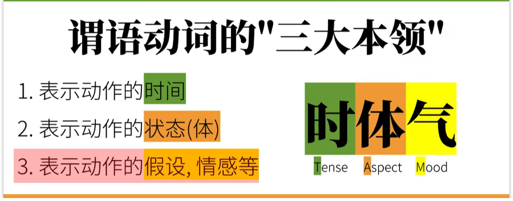
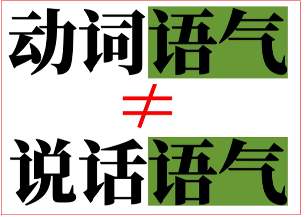
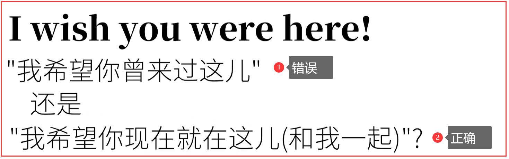

# 3.动词语气(虚拟语气)

## 3.1.动词语气简介

<font color=red><strong>动词的"语气"（Verb moods）它和一个人的"心情"(moods)可是毫无关系。</strong></font>之前在语法综述那个视频里说过，英语动词有中文没有的本领，而这些独特的英语动词本领，往往是我们中文母语人士学习的难点。

英语动词的一个主要本领是时态(也就是动词的时间+动词的状态)，在英语的时态中已经详细说了英语的16种时态；



<font color=red><strong>而英语动词的另一个本领就是语气(moods)。这里的"语气"是一个语法概念/术语，可不是我们"说话的语气"（比如"温柔的、凶狠的、愤怒的语气……）"。两个"语气"完全不同。</strong></font>



**英语动词语气的数量有不同的说法，但是最主要的是三种语气：陈述语气、祈使语气、虚拟语气。**也有其他语法体系会包含疑问语气、条件语气、感叹语气等


## 3.2.陈述语气（Indicative mood）

陈述语气（Indicative mood）说白了就是描述现实。

比如："这兔子吃了胡萝卜。"


在时态合集里，看到的例子全是陈述语气。也可以对以上这个描述显示的句子进行提问。

比如：

- Did the rabbit eat the carrot？
- Was the rabbit hungry？

有的语法体系会把这里（问句）的动词语气另外归类为"疑问语气（interrogative mood）"，虽然"疑问语气"在英语中的构成往往只是改变词序或加助动词。

## 3.3.祈使语气（imperative mood）

祈使语气（imperative mood）就是命令/请求。

比如：

兔子，吃这胡萝卜！

Rabbit,eat the carrot！


这个很好理解，因为中文里咱们也经常用这样的祈使句。

再比如：


<font color=red><strong>祈使句小窍门：绝大多数情况下，祈使语气就是把你的命令/请求用第二人称（"你"）用一般现在时态表达，然后把其中的"你"去掉，并保证动词原形就好。</strong></font>

比如：


## 3.4.虚拟语气（subjunctive mood）

### 3.4.1.简介

虚拟语气（subjunctive mood）之所以是个英语学习的难点。主要是因为虽然中文有同样意思的"表达"，但中文动词本身没有动词变位，而英语中动词的虚拟语气是要变位（改变拼写）的。看到虚拟（subjunctive）这个词，你可能会想到subject（主语）或者subjective（主观的）这个词，但是从构词上来说，两者是很不同的意思。

subjunctive mood（虚拟语气）可不是subjective mood（这个不存在）.subjective这个词的原义是:"在地下的、被支配的"，后指"真实的"，后被赋予新的词义，即"主观的，脑中发生的"，此后这个定义才进入日常使用。

**优美的组合：因为sujunctive的原义是"在地下连接的"，暗指语法结构上的从句，（而虚拟语气也的确基本只用于从句中，包括条件从句）。不过巧合的是subjunction的主要目的就是描述"脑中的情况"。**


可以理解为：英语在"描述动作/事件"这一方面的思维习惯：

<font color=red><strong>如果是描述你脑中想象的，尤其是和事实相反的，或者说是"主观的意愿"，那我们就要用动词的虚拟语气了。</strong></font>

<font color=red><strong>如果是描述现实，包括直接描述请求命令，那么我们就不能用动词的虚拟语气，而是用陈述语气、祈使语气。</strong></font>

### 3.4.2.虚拟语气表"不可能"假设

<font color=red><strong>虚拟语气第一大用法：虚拟语气表"不可能"假设</strong></font>

#### 3.4.2.1.与现在事实相反

如果某个描述与事实相反。

```wiki
如果我现在看到那只兔子的话，我会咬他.
if i see the rabbit now,i will bite him.(虚拟语气错误)
why？
因为句中有个now表示就是现在,很明确的时间。
i see the rabbit和i will bite him都是客观描述的事实（see）或者很确定在将来会发生的事情（will bite）。


如果要表达与实现不同就要用虚拟语气，就要把动词时间往过去推一个时间段。
变成：If i saw the rabbit now，I would bite him.（虚拟语气）

分析：此时句中出现了动词see以及助动词will的过去式（saw，would）？
这就是英语虚拟语气的难点。这里动词（saw，would）是"过去式",但是并不表示过去时间，也就是说，这句话不是在描述过去发生的事实，而是在描述现在的、没发生，但是希望发生的事。是一个主观意愿或者说想象的假设。换句话说，只是看见句中出现了saw这一个过去式，还不能仅仅根据这一信息来判断这是过去时间。而英语考试特别爱考这一点，因为在这一点上"能做很多文章"。

这是虚拟语气的第一种用法,表示和现在事实相反的。
```

<font color=red><strong>对现在不可能的假设，条件语句中动词虚拟语气要用过去式表示，主句用would + 动词原形。</strong></font>


**如：If i knew it,I would tell you.**

**如果我现在知道（其实我并不知道）,我现在会告诉你.**

补充：<font color=red><strong>如果动词是be，不管是什么人称，过去式要用were，而不是was。</strong></font>

如：If i were you, I would give this video a thumbs-up**

**如果我是你，我会给这个视频点赞. **

#### 3.4.2.2.与将来相反

<font color=red><strong>和将来事实相反的（可能性极低），或者描述将来很小可能性的动作/事件。</strong></font>

```wiki
If i see the rabbit tomorrow,I will bite him.
这句话显然是正确的，这里的动词see没有用虚拟语气，而是"陈述语气"，有个语法体系也会把这样的动词语气另外归类为"条件语气（conditional mood）"，虽然"条件语气"的构成在英语中和陈述语气没有区别。
表达的意思：如果明天真的如果看到了这只兔子，肯定就可以去咬兔子了。此时就不是虚拟语气了

如果我明确知道明天这只兔子肯定不会看到，于是只能用虚拟语气说：万一明天我看到了这只兔子，我要咬他。这里的万一就是表明可能性极低，与明天的事实相反，只是想象而已。
此时对应的英文一般也用虚拟语气，（表示将来时间里，可能性很小的动作）
虚拟语气：If i should see the rabbit tomorrow，I would bite him.
条件句里动词虚拟语气构成是should + 动词原形，而主句不能用will bite（因为很确定采用将来时态will bite），这里是虚拟语气，所以要用would bite
```

<font color=red><strong>对将来的"不可能"假设，所谓"将来不可能"除了真的不可能（如我当上美帝总统）之外，也包括将来的"可能性很小"的动作/事件。</strong></font>

<font color=red><strong>条件句中动词虚拟语气构成是should + 动词原形，而主句一般也要用would +动词原形。</strong></font>


<font color=red><strong>此处条件句中should是shall的过去式，并没有应该的含义。而should的另一个身份， 做情态助（动）词时，才有"应该"这层含义。</strong></font>

补充相似的助动词的过去式变位

| 原形  | 过去式 |
| ----- | ------ |
| shall | should |
| will  | would  |
| can   | could  |
| may   | might  |

如：**If I should meet thee after long years,how should i greet thee.**

**万一我们将来重逢了，我又该如何面对你呢？**

#### 3.4.2.3.与过去事实相反

<font color=red><strong>如果表示与过去已经发生的事实相反，不可能的情况；条件句中动词虚拟语气要had + 动词过去分词，主句一般为would  hava  +  动词过去分词。</strong></font>


例：

<font color=red><strong>If I had watched this video before，I would hava aced my test.</strong></font>

<font color=red><strong>我要是之前看了这个视频，那绝对能考个好成绩.(言下之意，我之前并没有看过这个视频，很可能我也没有考出好成绩)</strong></font>

### 3.4.3.虚拟语气表达愿望、请求、建议、命令,等

<strong>虚拟语气第二大用法：虚拟语气表达愿望，请求，建议，命令，等</strong>

#### 3.4.3.1.对现在的愿望

<font color=red><strong>说白了就是"希望某个动作/事件"发生，其实可以理解为，这样的"希望"也是发生在我们的脑中的，而不是现实中已经发生了的事。</strong></font>

<font color=red><strong>而这样的虚拟语气用法特征也很明显，因为这样的动词虚拟语气一般和一些'"表达意愿的词'一起使用；最具代表性的就是wish这个词。</strong></font>

**wish，中文一般翻译成希望；hope，也翻译成希望。wish是希望可能性小的事发生，而hope就比较中性。**

**所以wish和其他动词的虚拟语气一块儿使用。**

<font color=red><strong>wish 对现在的愿望： wish + 动词过去式；如果动词是be，则过去式用were，不管是哪个人称。</strong></font>

```wiki
I wish that I were a rabbit 

我希望我是只兔子，
```

**这个句子中，I是主语，wish是谓语动词，that引导的从句做句子的宾语，也就是有个宾语从句。这里引导从句的that往往可以忽略，所以I wish I were a rabbit也对；这样的形式其实和之前讲假设情况中的If I were的构成是一样的。**

易错点补充：


<font color=red><strong>常见的错误和之前一样，If I am a rabbit……，这样说就很奇怪了，因为am是be这个动词的陈述语气，所以I am是陈述，表示事实上我就是只兔子，因此不能假设。</strong></font>
<font color=red><strong>I wish (that) I am a rabbit也是一样的问题，I am都已经表面我是兔子了，又怎么能再做这样的希望呢？</strong></font>

补充



#### 3.4.3.2.对过去的愿望


**这里希望的是不可能的事儿，言下之意就是我之前没有吃那个胡萝卜。**

<font color=red><strong>对过去的愿望构成是：wish + had/would hava + 动词的过去分词</strong></font>

#### 3.4.3.3.对将来的愿望


**我希望我能吃那只胡萝卜，言下之意是我大概率吃不到那只胡萝卜。**

<font color=red><strong>对将来的愿望构成是：wish + would/could/might  + 动词原形</strong></font>

#### 3.4.3.4.补充

<font color=red><strong>表达对现在、将来、过去的某个动作/事件的希望。那么表达意愿，请求，建议，命令当然不止wish一个词。</strong></font>

1. would rather

   - 对现在的希望

     

     一看见didn't do it，你是不是本能认为那是过去？，要注意的是，这里would rather和wish一样，后面要接虚拟语气。
     所以**这里表达现在的希望**，所以这句话意思是：我宁愿你现在，或者说接下来不要吃那只胡萝卜。言下之意，你还没有吃，我希望你别吃。

   - 对过去的希望

     

     **这样就是表达对过去的希望了，表示我宁愿你没有吃掉那只胡萝卜。但是恰恰因为用了虚拟语气，所以可以推断出，你已经把那根胡萝卜吃掉了，我也只是对过去的希望而已。**

2. 其他

   **除wish、would rather之外，还可以用demand，suggest，insist，order……，这样的词表达请求，建议，命令。**

   而这样的词后面接的虚拟语气一律是<font color=red><strong>should+动词原形</strong></font>，这个和wish稍微不同，请注意。

   - 现在

     

   - 过去

     

     也可以变化一下句式，表达相同或者相似的意思。刚才I suggest that you(should) eat a carrot.是个宾语从句；
     我们可以把它变为一个主语从句。
     It is suggested that you (should) eat a carrot(主语从句)
     把它变成一个主语补语从句
     The suggestion is that you(should) eat a carrot(主语补语/表语从句)
     还有时候说建议甚至都不要用到wish，suggest，demand这样的永磁，比如我们还可以说：
     It is (high) time that you ate a carrot(定义从句)（high在这里表示早该这样做了，这里的ate也是虚拟语气，而这里的从句是一个定语从句）

     

## 3.5.英语动词语气总结


```html
<strong></strong>
<font><strong></strong></font>
<font color=red><strong></strong></font>
<font color=red> </font>
```

