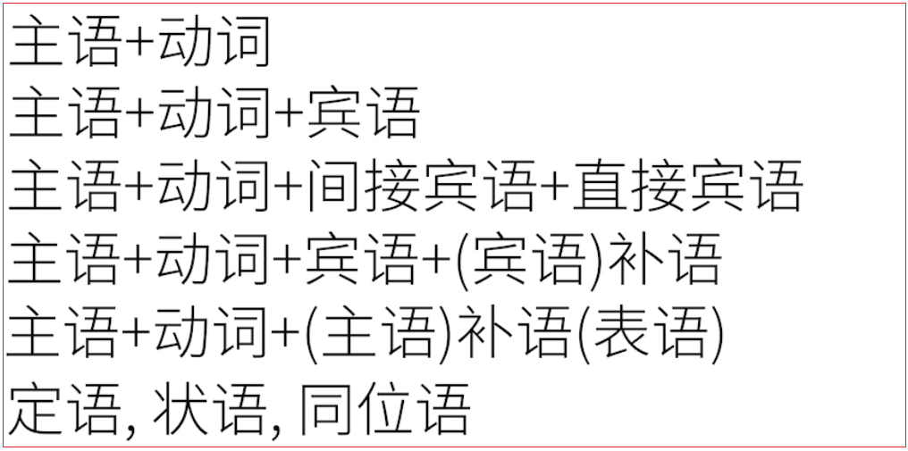
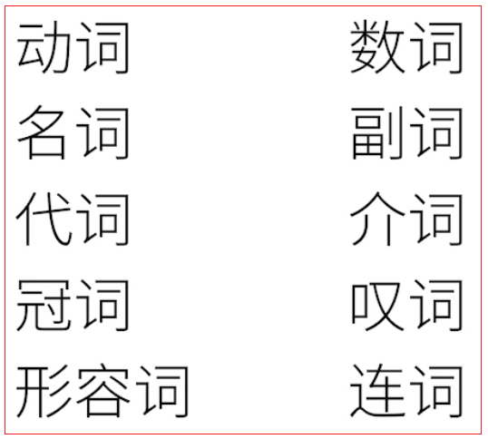
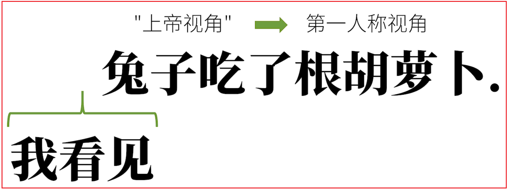
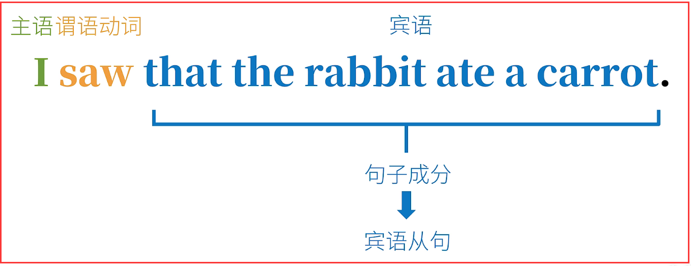
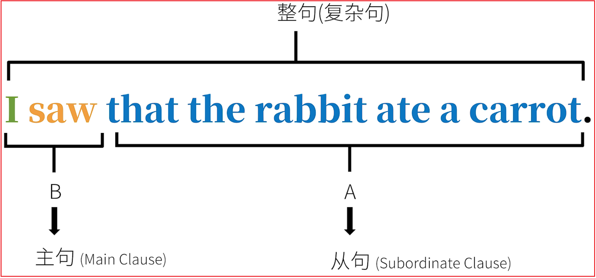

# 4.从句

## 4.1.从句综述

### 4.1.1.英语从句的原理

在之前的"英语语法体系"里，我们讲了句子的"成分(Clause Elements)"和"词性（词类）（Parts of Speech）"。

1. 句子成分/句型

   

2. 词性（词类）

   


例句：


这句话是以"上帝视角"来叙述的，如果改为第一人称叙述就是：



请问这句话的句子成分分别是什么？


这句话中我看见的到底是什么？

**其实是"兔子吃了跟胡萝卜"这个动作/事件本身。所以整个原本可以单独成句的"兔子吃了根胡萝卜"，就是一个"由句子变过来的大宾语"。也就是说，中文的"兔子吃了根胡萝卜"成了另一个句子的句子成分。**



**that I saw that the rabbit ate a carrot就是一个"大宾语",这个大宾语就是所谓的"宾语从句"。**

<font color=red><strong>从这个宾语从句的例子可以拓展来说，在英语中，一个句子A可以成为一个整句的某种句子成分，可以理解为A成了整句B的部分附属，从属B，同时也不能不独立成句了。这就是英语从句的原理。</strong></font>



<font color=red><strong>A就是所谓"从句（subordinate clause）"，B就是所谓"主句（main clause）",他们合在一起就是一句"复杂句"。</strong></font>

### 4.1.2.英语从句的分类


```html
<strong></strong>
<font><strong></strong></font>
<font color=red><strong></strong></font>
<font color=red> </font>
```

