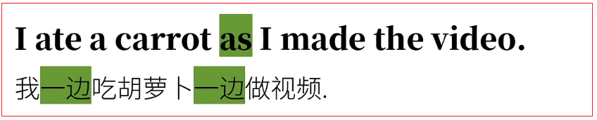
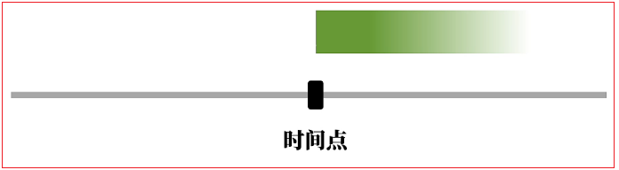

# 4.从句

## 4.1.从句综述

### 4.1.1.英语从句的原理

#### 4.1.1.1.英语的三种句子分类


#### 4.1.1.2.英语从句的原理

例句：


这句话是以"上帝视角"来叙述的，如果改为第一人称叙述就是：


请问这句话的句子成分分别是什么？


这句话中我看见的到底是什么？

**其实是"兔子吃了跟胡萝卜"这个动作/事件本身。所以整个原本可以单独成句的"兔子吃了根胡萝卜"，就是一个"由句子变过来的大宾语"。也就是说，中文的"兔子吃了根胡萝卜"成了另一个句子的句子成分。**


**that I saw that the rabbit ate a carrot就是一个"大宾语",这个大宾语就是所谓的"宾语从句"。**

<font color=red><strong>从这个宾语从句的例子可以拓展来说，在英语中，一个句子A可以成为一个整句的某种句子成分，可以理解为A成了整句B的部分附属，从属B，同时也不能不独立成句了。这就是英语从句的原理。</strong></font>


<font color=red><strong>A就是"从句（subordinate clause）"，B就是"主句（main clause）",他们合在一起就是一句"复杂句"。</strong></font>

### 4.1.2.英语从句的分类

在之前的"英语语法体系"里，讲了句子的"成分(Clause Elements)"和"词性（词类）（Parts of Speech）"。因此可以根据句子成分和词性（词类）给从句分类。

#### 4.1.2.1.按句子成分分类

英语从句的分类：一个从句充当主语的句子成分，只需要列出所有句子成分就知道有哪些从句了。


#### 4.1.2.2.按照词类给从句分类


## 4.2.形容词从句

<strong>形容词从句对某个人或者事物进行描述，具有形容词的性质，所以被称为<font color=red>"形容词从句"</font>，同时因为它在句中充当定语这个句子成分，所以也被称为<font color=red>"定语从句"</font>。</strong>

**这种从句让很多中国人很头疼。主要时因为他的构成或者说"造句习惯"，和中文习惯有差异很大，而这种"造句差异"实际是中西方"思维差异"导致的。**

### 4.2.1.形容词从句的思维方式

例句：<strong>The rabbit is eating a carrot.	兔子在吃一根胡萝卜</strong>

#### 4.2.1.1.中文思维方式

将其扩写：兔子在吃一根我买来的胡萝卜。

这个句话在我们中文造句习惯看起来很简单，我们会本能地这么理解/断句：


<font color=red><strong>这句话里"我买来的"是修饰之后的"胡萝卜"的"补充/限定信息"，所以是定语。</strong></font>

可是这个对我们来说非常简单的句子，如果给刚学中文没多久的英美人士看，就可能绕不清了。即使告诉他们每个词的词义，他们还是可能这么断句：


这显然是有问题的。但是英语母语人士往往无法意思到，这里的"我买来的"是个大定语。

同样如下：


<font color=red><strong>在中文里，无论定语是单个形容词也好（如"好吃的"），又或者是一句话充当的(如"我买来了的")，都是放在被修饰的名词/代词（如胡萝卜）；</strong></font>


<font color=red><strong>中文构成定语特别简单，基本就是"形容词/句子 + 的"</strong></font>

#### 4.2.1.2.英文思维方式

<font color=red><strong>英语构成定语的方式和中文就不一样了。虽然单个形容词（多个形容词、副词加形容词）作定语也是放在被修饰词之前。</strong></font>如：


如果定语要用一句话来描述时，就没有办法像中文一样通过"形容词/句子 + 的"结构来实现了。

例如：在英语中一根我买来的胡萝卜：


<font color=red><strong>这样英语定语的思维方式，可以理解为：在被修饰的词之后，添加一个和它有关系的词，然后再把这个新词放到另一个句子中进行补充说明/逻辑阐述。语法上这个新词叫"关系词"，它之前的被修饰的词叫"先行词"，这里的"另一个句子"就是"定语从句/形容词从句"，而且因为其中包含"关系词"的缘故，这样的从句也被称之"关系从句"。所以，如果在不同的语法体系里看到"形容词从句"、"定语从句"、关系从句，他们都是一样的。</strong></font>


#### 4.2.1.3.总结


<font color=red><strong>这里的"that I bought"就是个定语从句，作修饰carrot的定语。</strong></font>

中文句子的定语都是"前置"的，从句做定语都是后置的。

| 中文定语                                                     | 英文定语                                                     |
| ------------------------------------------------------------ | ------------------------------------------------------------ |
| 一根<font color=red><strong>好吃的</strong></font>胡萝卜     | a <font color=red><strong>tasty</strong></font> carrot       |
| 一根<font color=red><strong>兔子吃了的</strong></font>胡萝卜 | a carrot <font color=red><strong>that the rabbit ate</strong></font> |
| 一个<font color=red><strong>是兔子的</strong></font>老师     | a teacher <font color=red><strong>who is a rabbit</strong></font> |
| 一个<font color=red><strong>我昨天看见的</strong></font>老师 | a teacher <font color=red><strong>whom l saw yesterday</strong></font> |
| <font color=red><strong>兔子吃胡萝卜的</strong></font>地方   | the place <font color=red><strong>where the rabbit ate the carrot</strong></font> |
| <font color=red><strong>兔子吃胡萝卜的</strong></font>原因   | the reason <font color=red><strong>why the rabbit ate the carrot</strong></font> |

示例：


以上句子在中英文里都不可取，更好的方式是拆句。

### 4.2.2.形容词从句的构成

#### 4.2.2.1.关系代词

<font color=red><strong>形容词从句中有个"关系词"，用来引导形容词从句，关系词可以分为"关系代词"和"关系副词"。</strong></font>


他们有什么区别呢？

例句：


<font color=red><strong>that作为that I bought的引导词，起代词的作用，所以术语关系词中"关系代词"。不止是that，很多之前见过的词也可以做关系代词。</strong></font>

比如：

1. The rabbit is eating a carrot <font color=red><strong>that l bought</strong></font>.
2. The teacher <font color=red><strong>who ate a carrot</strong></font> is a rabbit.
3. The teacher <font color=red><strong>whom l saw yesterday</strong></font> is a rabbit.
4. The teacher <font color=red><strong>whose favorite food is carrot</strong></font> is a rabbit.
5. The food <font color=red><strong>which the teacher likes</strong></font> is a carrot.

这里的关系代词之所以是who、whom、whose、which都是为了在他们的引导的从句中更通顺，因为这些词表达的逻辑关系，实际上是从对应的陈述句里变过来的。而这些从句中，除去关系代词在开头做引导词，其他词的词序与对应的陈述的语序是一致的。

这么说好像有点抽象，具体看一下充当定语的"原本"是陈述句的句子：


#### 4.2.2.2.that和which的比较

The food <font color=red><strong>which</strong></font> the teacher likes is a carrot.

上述句子的关系代词是which，它代表之前的food。这里其实也可以用that。

即：The food <font color=red><strong>that</strong></font> the teacher likes is a carrot.

也就是说，关系代词that和which经常可以互换。

他们到底有什么区别呢？

| 先行词特点   | 先行词 |
| ------------ | ------ |
| 先行词唯一的 | that   |
| 先行词多选一 | which  |

- <font color=red><strong>如果先行词明确、唯一、没有其他可能时，选择that；</strong></font>
- <font color=red><strong>如果是多个同类事物中按限定条件选择，则不一定用that，也可以用which；</strong></font>

1. 先行词唯一的：that

   The rabbit ate **the largest carrot** that l've ever seen.

   the largest 已经说了是"最大的"，就是唯一的，所以用关系代词只能是that。

   同理：

   1. <font color=red><strong>all</strong></font> the rabbits that ate a carrot
   2. <font color=red><strong>the only</strong></font> rabbit that ate a carrot
   3. <font color=red><strong>the first</strong></font> rabbit that ate a carrot

   <font color=red><strong>all、only、first也表明了明确的对象，没得选，只能用that。</strong></font>

2. 先行词多选一：which

   The rabbit ate a carrot <font color=red><strong>which</strong></font> l bought.

   兔子吃的是我买的胡萝卜，里面的一根。即"我买的"限定了兔子吃的胡萝卜的范围，当然这里的which也依旧可以用that。

   The rabbit ate a carrot <font color=red><strong>that</strong></font> l bought.

#### 4.2.2.3.关系副词

示例：

1. This was the **place** <font color=red><strong>where</strong></font> the rabbit ate the carrot.
2. This is the **reason** <font color=red><strong>why</strong></font> the rabbit ate the carro
3. That was the **day** <font color=red><strong>when</strong></font> the rabbit ate the carrot for the first time.

<font color=red><strong>以上几句包含了形容词从句where the rabbit ate the carrot.修饰place；
why the rabbit ate the carrot修饰reason；when the rabbit ate the carrot for the first time.修饰day。
其实和之前关系代词引导的差不多，只不过这几个词where、why、when在从句中的词类（词性）不是代词，而是副词。因此这些引导词术语关系词中的"关系副词"。</strong></font>

我们也可以把这些关系副词转化为关系代词；

1. This was the **place** <font color=red><strong>at which</strong></font> the rabbit ate the carrot.
2. This is the **reason**  <font color=red><strong>for which</strong></font>  the rabbit ate the carrot
3. That was the **day**  <font color=red><strong>on which</strong></font>  the rabbit ate the carrot for the first time.

<font color=red><strong>可以看出关系副词相当于介词 + 关系代词which，即关系副词 = 介词 + which</strong></font>

### 4.2.3.形容词从句的限定性和非限定性

#### 4.2.3.1.限定性形容词从句

<font color=red><strong>现在可以清楚知道形容词从句/定语从句的主要功能了，即：限定范围。</strong></font>

比如：The rabbit ate the carrot <font color=red><strong>which was on the table</strong></font>

这里的从句which was on the table就是为了限定carrot的范围，言下之意就是有好多胡萝卜，但是这兔子就吃了其中的一根，哪一根？桌子上的其中一根。

#### 4.2.3.2.非限定性形容词从句

<font color=red><strong>非限定性形容词从句顾名思义，就是没有限定作用的从句。</strong></font>

例句：**The rabbit ate the carrot,<font color=red><strong>which</strong></font> was on the table.**

相当于：**The rabbit ate the carrot,<font color=red><strong>the carrot</strong></font> was on the table.**

可以理解为连续说两次the carrot太啰嗦，所以用一个代词which来代替the carrot，避免重逢。也就是说，这样的从句根本没意义限定作用。因为只不过用了个代词"接着说话"而已。The rabbit ate the carrot,<font color=red><strong>the carrot</strong></font> was on the table.其实就是一前一后表达两个信息：

兔子吃胡萝卜和胡萝卜（再被吃之前）在桌上。言下之意是，完全有可能只有一根胡萝卜。然后补充信息是，这个跟胡萝卜恰好在桌上而已。

举例：


<font color=red><strong>正因为非限定性形容词从句这种"非限定的"，"接着补充"（而非限定）的特性，所以往往用来做句子的插入语。</strong></font>

比如：


<font color=red><strong>这个两个作插入语的形容词从句，都可以直接去掉不影响句意，而且正因为只是补充信息用，所以前面加the biggest这样"确定唯一"的限定词一点问题都没有。</strong></font>

但是不能说：


<font color=red><strong>那样就变成限定性定语从句的形式了，which就和前面的the biggest冲突了。</strong></font>

**非限定性形容词从句更厉害的是，不一定是补充某个先行词，而是可以指代整句话。**

比如：


**这里的which不是指rabbit和carrot，而是之前的整个The rabbit ate the carrot这件事。也就是，兔子吃了胡萝卜，这事不令人吃惊。**

## 4.3.主语从句

<font color=red><strong>名词从句包括：主语从句、宾语从句、表语从句（主语补语从句）、同位语从句、以及有些资料不收录的宾语补语从句。</strong></font>

### 4.3.1.主语从句原理

<font color=red><strong>在简单句中，主语是名词fact。而我们只要把这个主语fact（以及之前的定冠词the）换成一个从句，就得到了一个主语的从句，即主语从句。如：</strong></font>


<font color=red><strong>其中的That the rabbit ate a carrot就是引导词that引导的主语从句。</strong></font>

这句话该如何翻译？

可不可以直接把"这事实"换成"兔子吃了胡萝卜"呢，即：


兔子吃了胡萝卜是明显的，这样翻译很难断句，很容易想"兔子是明显的？"或者"胡萝卜是明显的？"

<font color=red><strong>这样的句子在中文里，缺少一个标志，表示一个句子是另一个句子的句子成分的标志。</strong></font>

但是可以看到英文中句首的that，我们已经知道，that经常充当从句的引导词。再具体一点说，这个引导词that再这里，是个"从属连词"。它也是一个信号，表示接下来从句开始了。一看到或者听到That the rabbit ate a carrot，英美人士会立即意识到这是一个从句，是整个句子的一部分而已，而我们中文因为没有所谓"引导词"，所以往往翻译这句话为：


所以说白了主语从句就是句子主语由从句充当，而其他成分不变。比如：刚才这个句子That the rabbit ate a carrot is obvious.主语从句之后是is obvious.也可以换成其他的构成，比如名词，被动语态，不及物动词：


观察That the rabbit ate a carrot is obvious.这句话，这个主语从句表达了一个很确定的信息，即"兔子吃了胡萝卜"。但是不确定的信息也可以构成主语从句。比如，我们可以把"兔子吃了胡萝卜"这个确定的信息，转为不确定的信息：


<font color=red><strong>由此可以看出中英文翻译的最大区别，那就是主语从句是要以引导词开头的（要不然怎么叫"引导词"呢），这些引导词都是像what、where、when这样的代词/副词。他们如果出现在问句中，被叫做"疑问代词/疑问副词"。这里用来引导从句，也就是作从句的"引导词"，属于"连接代词/连接副词"。而从句除去引导词，剩下的词语序和中文是基本一致的。</strong></font>


### 4.3.2.形式主语

<font color=red><strong>直到现在为止，我们的句子都是遵照通常的语序，把主语也就是刚才那些主语从句，放在句子开头。但是在这样的结构中开头的主语从句有时还会会很长，这样会导致说了很久关键信息才出来。</strong></font>


比如，把That the rabbit ate a carrot is obvious.扩写一下，


这样说话理解很吃力，因为说了半天我们才知道，原来你说到最后就是想说这事很明显，这也太头重脚轻了，英语母语人士往往不太习惯这样的句子，他们会改个形式说出来，像这样：


这里的It不是平时指代物体的代词"它"，而是指代后面的从句，本身没有任何意义，所以被称为"形式主语"，它代表的是后面真正的主语，也就是之后的主语从句，也就是说，放在句子后面的从句才是真正的主语。这样的形式主语it开头的句子构成很简单，就是用it把整句话用之前的语序说完，然后紧接着加上从句就可以了。

所以，我们开头说到的"很明显，兔子吃了胡萝卜"对应的英语就是：

It is obvious that the rabbit ate a carrot.


翻译为：很明显，兔子今天晚饭已经吃了根胡萝卜。

千万不能把这些句子翻译成"它很明显……"这样的句子。如果形式主语it指代的内容比较多，我们中文就可以拆句。


同样的也可以把之前的几句话改为带有形式主语的句子：


同理也可以把"不确定信息"的句子改写一下：


It is + 形容词 + that ……这个结构有点眼熟，在动词虚拟语气曾经看过。


## 4.4.宾语从句

<font color=red><strong>宾语从句就是从句在整个复杂句中做宾语，这样的从句有可能包含确定信息，也可能包含不确定信息。</strong></font>

### 4.4.1.确定信息&不确定信息

#### 4.4.1.1.确定信息作宾语


<strong>其中的that the rabbit ate a carrot就是个宾语从句，作动词saw的直接宾语。这里的that the rabbit ate a carrot是个确定的信息。</strong>

#### 4.4.1.2.不确定信息作宾语从句

<font color=red><strong>而和之前主语从句一样，不确定的信息也可以作从句，充当句子的宾语。</strong></font>

注意事项：

1. <font color=red><strong>除了某些介词参与的情况，从句的引导词基本都在从句的开头。（否则干嘛叫引导词）。而其他的词遵照正常的陈述语序，基本也和中文一致.</strong></font>

   

2. <font color=red><strong>千万不要看到whether、where、when、how这样的词就以为看到了包含疑问代词/疑问副词的问句，于是在之后错误地家伙是哪个助动词。</strong></font>

   以下的句子是错误的：

   1. You told me whether <font color=red><strong><del>does</del></strong></font> the rabbit eat the carrot.
   2. You told me where <font color=red><strong><del>does</del></strong></font> the rabbit eat the carrot.
   3. You told me when <font color=red><strong><del>does</del></strong></font> the rabbit eat the carrot.
   4. You told me how <font color=red><strong><del>does</del></strong></font> the rabbit eat the carrot.

### 4.4.2.引导词that的省略

#### 4.4.2.1.省略引导词that

<font color=red><strong>在口语或非正式书面语中，宾语从句的引导词that往往可以省略。</strong></font>比如：


**正因为这个that可以省略，所以有时间咱们有的同学看到I know the rabbit ate a carrot.都意识不到这里有个宾语从句，说不定还会奇怪，"为啥一个简单句有俩谓语动词呢？"殊不知，know是主句里的动词，而ate是从句那里的动词。**


<font color=red><strong>只有引导词that可以省略。而引导词what、who、which、when、where、how等则不可以省略。</strong></font>


#### 4.4.2.2.不可省略引导词that

**也有时间引导词that不可省略，否则句子有歧义或者语法错误。**

比如：


第一个that去掉还好，但是如果第二个that也去掉，那就可以这么断句：


<font color=red><strong>第一个that去掉还好，但是如果第二个that也去掉，那就可以这么断句：(I didn't know that the rabbit ate the carrot) and (you saw it).
不再是I didn't know that you saw it.而是很确定地陈述you saw it.</strong></font>


再比如插入语：

**如果去掉that，会让人一下子反应不过来后面是个从句，从而认为这句话有语病。**


#### 4.4.2.3.某些词后的宾语从句的否定

经常表达某种意见时会用到宾语从句,如：


<font color=red><strong>宾语从句在做否定时，否定往往是加在主语的谓语动词前面，而不是从句里。</strong></font>

也就是：


<font color=red><strong>否定加在不同的地方会导致微妙的差别，但是从习惯上来讲，像这样的句子，在英语，绝大多数情况是把否定加在动词前的。</strong></font>

#### 4.4.2.4.主从时态一致

<font color=red><strong>在大多数情况下，宾语从句和主句中的时态要保持一致。</strong></font>

比如：


<strong>如果要改成过去式，就不能光改主句。</strong>
<strong>主句描述过去的动作，但是过去式动作包含一般现实时态，岂不是未卜先知了吗？</strong>
<strong>所以，正确的说法是主句和从句要保证时态一致。</strong>


<strong>虽然like是一个"习惯性"的动作/行为，但是因为它所在的从句紧跟过去时间的主句，所以也要用动词过去式liked而不是like。</strong>

<strong>只有"不变"的客观现象才是例外，如：I knew (that) the sun rises in the east.如果用rose的过去式rose反而很奇怪。I knew (that) the sun rosein the east.这句话似乎在暗示，太阳过去从东边升起，可是之后就不一定了。</strong>


#### 4.4.2.5.be + 形容词 + that……

be + 形容词 + that……是一个常见且很有"归类争议"的句型。

比如：


之所以说这样的句型归类有争议，是因为它往往被不同的老师/学者归类为：

1. 宾语从句

   之所以在这里讲解，是因为同位语从句和状语从句我们之后才会讲到，而这样句子归类为宾语从句的理由是：**其中的形容词通常都是表达某种看法/判断，而that引导的从句相当于看法/判断，尤其是在中文表达中。比如I'm sure that ……我确信的是什么？我确信的就是that后面的信息，所以这样的用法和动作后加承受者很相似。**也就是说，以上句子相当于：

   

2. 同位语从句

   有些认为这样的句子术语同位语从句，因为：
   I am sure that…… 相当于 I am sure of the fact that……；
   I am happy that…… 相当于 I am happy about the fact that……；
   I am afraid that…… 相当于 I am afraid of the fact that……；

   

   **如果这样看，那么that引导的从句实际上相当于同位语。这么说似乎稍微有些牵强，因为句中毕竟没有出现fact之类的词。所以that引导的从句从形式上来看，并不等于另一个词（即同位语）。**

3. 状语从句

   **还有人认为这样的句子实际上是在描述原因，也就是原因状语从句（之后会讲）。**
   比如:
   **I am happy that there's a carrot on the table.相当于I am happy because there's a carrot on the table.**
   **这句话似乎是没有问题，可是像：I am sure that there's a carrot on the table.理解为I am sure because there's a carrot on the table.好像又有些说不通，总之，这个句型还没有一个定论。但是偏向于宾语从句的归类。**

## 4.5.表语从句

### 4.5.1.表语是什么？

说到主语和宾语这两种句子成分，我们都很清楚，即使没有学过也能"本能理解"。

什么是表语呢？

<font color=red><strong>在英语语法体系中说过五种基本动词中有一类动词叫（连）系动词（linking verbs），它的功能近似于给它之前和之后的部分划等号。</strong></font>


比如：


**I am a rabbit.中的系动词am就是在划等号；**
**The carrot tastes good.中的系动词tastes也是划等号，只不过多了一层"品尝"的意思。**
<font color=red><strong>而这样的系动词之前是主语（也包括主语从句），之后就是对主语做补充用的信息，所以叫"主语补语"。而"主语补语"的另一个名字就是"表语"，两者是一回事儿。这样一来"表语从句"就好理解了，就是用一个从句充当系动词之后的那个表语。</strong></font>


表语从句中最常见的系动词就是be动词。


而表语从句中的引导词和之前一样，也有很多可能。比如：


和之前见过的从句一样，引导词开头，之后的语序和陈述句基本一致。
其实可以看出表语从句（主语补语从句）往往就是把之前讲到的主语从句，移到系动词之后而已。


比如之前说的：

### 4.5.2.主语从句改为表语从句


**这两句话的意思大致相同，但是还有些微妙区别。主要体现在强调的信息。**

### 4.5.3.系动词：非be动词

<font color=red><strong>之前的例句中，表语从句所在的复杂句中，系动词都是be动词，但是前面说到，系动词不一定是be动词，也有可能是feel、seem、look、taste……这样的系动词。</strong></font>

所以咱们也能看到这样的表语从句：


**这些句子中的it并不是某个物体的"它"，而是个"形式主语"，没有实际意义，甚至可以理解为"占个位置"。句子真正要表达的意思其实全部被涵盖在了后面的从句中。而后面的从句，在语法上来说，是的的确确的表语成分，所以是表语从句。**

## 4.6.同位语从句

### 4.6.1.同位语

在之前的语法综述里说过，所谓"同位语"，其实就是用不同的方式把一个概念再说一遍，用逗号隔开（否则会乱作一团）。

比如：


**这句话里可不是有两个主语，分别是"老爹"以及"兔老爹"，他们是同一个概念。"兔老爹"只不过是"我的老师"另一个说法而已。所以，Papa Rabbit在这里是主语teacher的同位语。**


**同样的道理：我喜欢我的老师，兔老爹。这句话中，Papa Rabbit是宾语teacher的同位语。**

### 4.6.2.同位语从句

<font color=red><strong>当一个从句来充当同位语时，那么这个从句就是同位语从句，这样的从句常在句中修饰抽象的名词。因为抽象，所以才要"另一种方式来再说一遍"。</strong></font>

如：


**刚才的同位语从句包含了已知信息，同位语从句当然也可以包含未知信息。**

比如：


**这里的whether the rabbit  will eat the carrot也是个同位语从句，把主语question又说了一般.**


**其中，idea是宾语，所以之后的who ate the carrot。其中，idea是宾语，所以之后的who ate the carrot其实只是把这里的idea重新定义了一番，还是个同位语从句。是句中宾语idea的同位语。**

### 4.6.3.be + 形容词 + 从句

之前在宾语从句中看到这样的句子。


**但是，如果把这句话改成这样，那就一点争议都没有了，因为他就成立纯粹的"同位语从句"**


这里的同位语从句充当句子里的宾语fact的同位语。

## 4.7.宾语补语从句

宾语补语从句很多语法体系都不收录的从句


宾语补语从句需要宾语补语的从此，比如call、make、consider……等等。先看一个简单句：


**这句话中的me，是复杂及物动词call的宾语，而Papa Rabbit就是宾语补语，对宾语me进行补充。**

**我们只要将Papa Rabbit这个充当宾语补语的专有名词用从句替换，就能得到一个作宾语补语的从句，即宾语补语从句。**


**这里的what you like就是一个宾语补语从句**


**其中who I am today也是个宾语补语从句，就相当于把My education made me smart.中的形容词smart这个词替换了一下而已。这么一分析，宾语补语从句就很好理解了。**

## 4.8.副词（状语）从句

<font color=red><strong>可想而知，副词从句在句中起副词的作用，一般补充说明动词，形容词，副词等。从句子成分上来说，它充当了句子词状语，所以副词从句也叫"状语从句"。</strong></font>


**副词从句与之前两大类从句（即名词从句和形容词从句）相比，可以说种类很多，因为"作状语"在句子中作补充信息，有多种可能。**

可以根据用途/意义把副词从句分类：


### 4.8.1.时间副词（状语）从句

#### 4.8.1.1.在某一时间点之前

<font color=red><strong>从句引导词：before</strong></font>


#### 4.8.1.2.在某一时间点之中（当时）

<font color=red><strong>从句引导词：when、while、sa</strong></font>


三种引导词的不同在于：

1. **when：时间点，"突然"**

   

   <font color=red><strong>一般强调表示在某个时间点，如"当我回到家里的那个时候"。实际上when有"突然"之意。</strong></font>

   

2. **While：时间段**

   

   <font color=red><strong>While一般强调一个时间段内，如"当我在做视频这个时间段之内"</strong></font>

   

3. **As：同时**

   

   <font color=red><strong>As一般强调同时进行两个动作，如"同时吃胡萝卜和做视频"</strong></font>

   

#### 4.8.1.3.在某一时间点之后

<font color=red><strong>从句引导词：after</strong></font>


#### 4.8.1.4.从之前某一时间点开始算

<font color=red><strong>从句引导词：since</strong></font>



<font color=red><strong>注意这里是从某时间点算起的时间段，往往暗示了对后有影响。在之前的时态中提过，这样的情况下，一般要使用完成状态。</strong></font>


#### 4.8.1.5.直到之后某一时间点

<font color=red><strong>从句引导词：until</strong></font>


<font color=red><strong>这个有点像since的对立面，即从某一时间点算起，直到之后的某一时间点。</strong></font>


#### 4.8.1.6.一……就……

<font color=red><strong>从句引导词：as soon as</strong></font>


<font color=red><strong>相当于一个动作紧跟另一个动作发生</strong></font>


#### 4.8.1.7.下次……

<font color=red><strong>从句引导词：the next time</strong></font>


### 4.8.2.地点副词（状语）从句

<font color=red><strong>主要引导词就是where以及它的"强调形式（wherever、everywhere、anywhere）"，来表"地点"。</strong></font>

#### 4.8.2.1.引导词where

如：


继续观察：


所以光看引导词where，咱们还不能确定该从句是哪种从句，得分别对待。


#### 4.8.2.2.引导词where的强调形式

<font color=red><strong>之前提到where的强调形式，它有点近似中文的"不管哪里、任何地方、所有地方"。这样的引导词包括wherever、everywhere、anywhere。</strong></font>


### 4.8.3.比较副词从句

#### 4.8.3.1.英语语句：比较级

<font color=red><strong>英语的形容词有所谓的"比较级"。</strong></font>

比如：


还有带比较级的句子


**其实以上常见的句子都可以算是省略句，或者口语化用法。他们完整的，正式的形式都是副词（状语）从句中的比较副词（状语）从句；**

#### 4.8.3.2.比较副词从句："更……"


**其中than I am、than that one is、than Snow White is实际上都是副词从句，用"比较"的方式对前面的主句进行补充说明。**

**尤其是第一句这样的，用代词宾格me是口语化的形式，正式是He is smarter that I(am).**

#### 4.8.3.3.比较副词从句："同样得……"

比较，也不一定非要"更"怎么样，也可能"同样得"怎么样。

如：


<font color=red><strong>还有种常见的比较副词从句是the（比较级），the（比较级）。</strong></font>


### 4.8.4.条件副词从句

#### 4.8.4.1.条件副词从句和虚拟语气的区别

<font color=red><strong>条件副词从句其实就是我们通常说的"条件句"。</strong></font>


**这个条件只是单纯的假设，属于"真实条件句"。而我们之前讲虚拟语气时候，就讲到"虚拟条件句"，即和事实相反的假设。**

如：


**就是使用了动词虚拟语气的条件副词从句。**

#### 4.8.4.2.条件副词从句的"主将从现"的说法

**也是你听过条件副词从句有"主将从现"的说法，意思就是主句用将来时态，而从句用现在时态。**

比如上面的：


**两句话中，if引导了从句，使用的是一般现在时态；之后是主语，用一般将来时态。**

**从这里貌似可以看出"主将从现"的说法，主将从现是国内英语教学上最模糊的总结之一**

主将从现用到下面两句将不成立


所以到底我们会说主将从现呢？

主将从现中的"现"

<font color=red><strong>在时态中讲到的"一般现在时态"。它真的是表示"现在发生的动作/事件"吗？这个时态的重点往往不是"现在"这个时间，而是"一般"这个状态。</strong></font>

什么叫做一般状态？

- 简单的
- 默认的
- 普通的

比如：

1. Rabbit eat carrots.（兔子吃胡萝卜）
2. The sun rises in the east.(太阳从东边升起)

<font color=red><strong>一般现在时态最常见的情况就是表达习惯/客观事实，其中没有特别指出状态。虽然被称为"一般现在时"，却和"现在"没什么关系。</strong></font>


<font color=red><strong>如果你要说"现在正在进行的动作"，当然要用明确的现在进行时态。</strong></font>


例句：

If I see a carrot……

<font color=red><strong>如果我看见一根胡萝卜……。中间，真的有时间信息吗？，也许要说，那肯定是将来？这真的是明确在将来发生的事儿吗？如果你正确定了，为甚还要通'"如果"如果'，这不自相矛盾吗?</strong></font>

<font color=red><strong>英语"将来"时态指的是非常确定会发生的事情。I will eat a carrrot，是我确定我将来会吃根胡萝卜，问题是这么做的条件我也不确定是否会形成，所以条件只能用一般状态，if I see a carrot，而不是（if I will see a carrot.）。</strong></font>


<font color=red><strong>再重复一遍：我不确定我是否一定会看见一只胡萝卜，所以条件句中，只能"去掉时间信息",表达一个"一般、默认、普通"的状态，使用一般现在时态，而不是明确的会发生的"一般将来时态"。但是如果这个假设的条件成立，在这种情况下，我一定会明确地做"吃胡萝卜"这个动作，所以主句，也就是在这种条件成立的情况下，使用一般将来时态，表示明确在将来会发生的动作。</strong></font>


同理：在中文的表述是：

如果我将会看见（will see）一根胡萝卜，我会吃（wil eat）它	（×）

如果我看见（see）一根胡萝卜，我会吃（wil eat）它	（×）

#### 4.8.4.3.规律总结

<font color=red><strong>进一步从"规律"上说，条件句总比主句在时态上落后一个时间段。</strong></font>


这也可以应用于虚拟语气：


<font color=red><strong>为什么虚拟语气的条件句里有过去式或者过去分词，这恰恰是虚拟语气的特殊之处，虚拟语气条件句中saw并不是表达时间，不是说我明确在过去看见……，而是表达与现实相反的条件。</strong></font>

#### 4.8.4.4.引导词unless

<font color=red><strong>出来if可以引导条件副词从句，还有unless，其实就是把if反着说。</strong></font>

比较一下：


#### 4.8.4.5.其他引导词provided、as long as、in case

<font color=red><strong>除了if和unless这两种最主要的，还有其他一些词/词组可以构成条件副词从句。</strong></font>

比如：


### 4.8.5.让步副词从句


让步副词从句和之前的"条件副词从句"有些相通的地方，都是阐述某些情况或做出某种假设。但接下来会更进一步做出一个"相反/相对"的阐述。


最常见的就是"即使……也……"，所以才要"让步"这一说


```html
<strong></strong>
<font><strong></strong></font>
<font color=red><strong></strong></font>
<font color=red> </font>
```

