# 5. 非谓语动词简介

## 5.1.谓语动词与非谓语动词的区别

### 5.1.1.谓语动词

中文里可以有这样的句子：

- 兔子喜欢吃胡萝卜
- 兔子很高兴吃胡萝卜

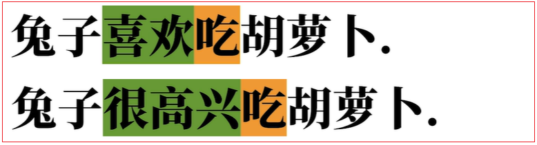

<font color=red><strong>这里面分别有两种动作的并列，"喜欢和吃"以及"（是）很高兴和吃"。在中文里这样表达不足为奇，把动作罗列在一起表达没有问题。这和中文思维一脉相承。</strong></font>

于是乎，在英文句子表达时，这种思维方式会影响到我们，所以就会出现：

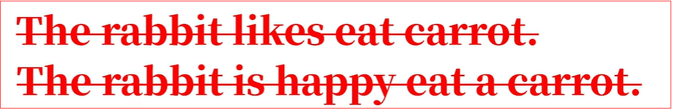

其实这样的表达对于中国来说，符合表达习惯。但是实际有严重的语法错误，甚至有事你都不会关注时态，因为中文汉字没有进行时态变位，或者人称变位。

于是也会看到这样的句子：


<font color=red><strong>以上句子的错误，就是没有搞清楚谓语动词和非谓语动词的关系，甚至还没有搞清楚谓语动词在句子中的作用。</strong></font>

<font color=red><strong>在英语语法综述中，谓语动词有"三大本领"，能够表达动词的时间、状态、语气。在句子中通过"动词变位"实现。</strong></font>

比如：

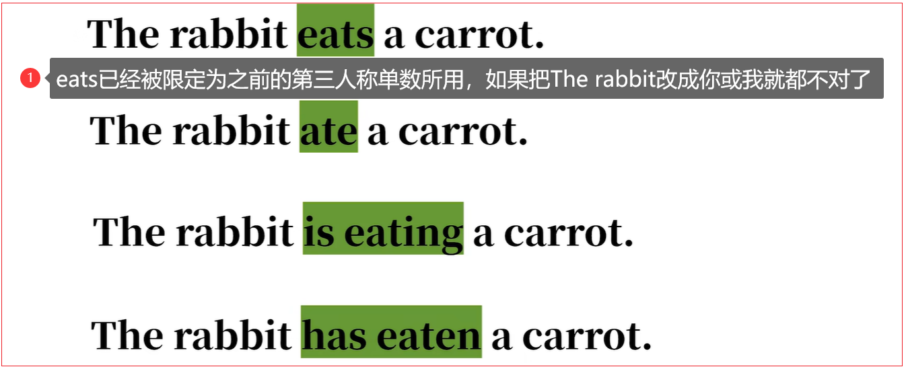

<font color=red><strong>这些句子中，谓语动词eat受到了主语限制，出现了时间、状态和语气的变化，实际上是一种被限定了的动词。所谓谓语动词还有另一个名字：限定性动词（finite verbs）。</strong></font>

### 5.1.2.非谓语动词

<font color=red><strong>与之相比的，就是不受主语限制，不被限定的动词；而这样的动词也就失去了表达时间和人称的本领，自然的这样的动词就是"非限定性动词（non-finite verbs）"。他的另一个名字就是下面要讲的"非谓语动词"。</strong></font>


举例说明：


<font color=red><strong>受主语限制、展现出时间、状态和语气变化本领的like、liked、am和likes这些动词，他们就是句中的谓语动词；</strong></font>
<font color=red><strong>而to eat，eating，taking，minced这些词，却不受主语限制，不具备表达时间和人称的本领，是"非限定性动词"，也就是非谓语动词。</strong></font>

<font color=red><strong>如果要用一句话总结谓语动词和非谓语动词的区别，那就是：谓语动词是句子的核心，而非谓语动词只能出现在剩下的非核心部分中。</strong></font>


### 5.1.3.总结

<font color=red><strong>结合之前的英语语法综述的内容，英语简单句通常表达的是"什么+怎么样"的问题，其中体现"怎么样"这个概念动词，一个简单句只能有一个，就是谓语动词，而剩下的"像是动词"的动词都不能重复表达这个概念，即非谓语动词。</strong></font>

<font color=red><strong>当一个动词称为句子的"助动词"也就是谓语动词，限定句子的时间等状态，如果再来一个动词再去限定一次，句子就不正确了。所以剩下的动词只好以非谓语动词的身份，在句子中做"非谓语"成分了。</strong></font>

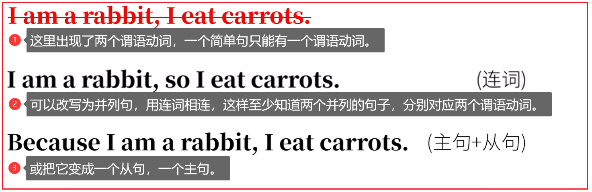

## 5.2.动词不定式

<font color=red><strong>动词不定式为什么"不定式"？不定式的英文是infinitive，是"无限"的意思。怎么"无限"呢？就是不受时间，人称等概念限制。</strong></font>

其实之前说的"非限定性动词"好像差不多的意思，所以才加non-finite verbs。千万别弄混不定式infinitive和非限定性（非谓语）non-finite。

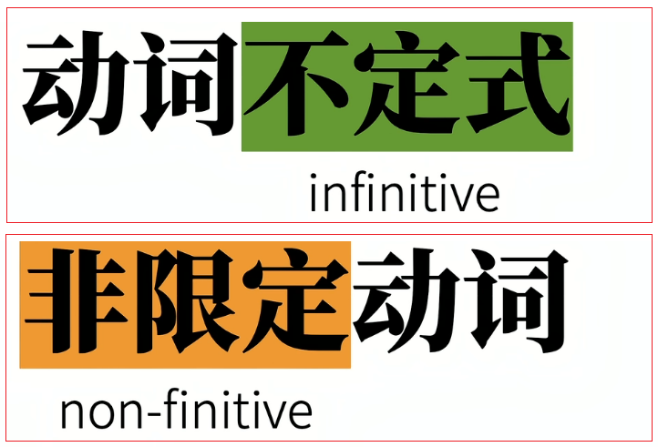

### 5.1.1.基础概念

<font color=red><strong>通常，不定式的形式为to+动词原形。</strong></font>

比如哈姆雷特经典名句：

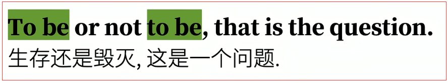

但有的是，to也会省略，比如：

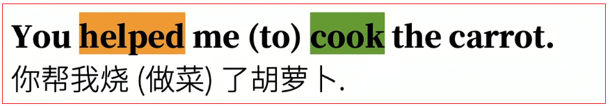

<font color=red><strong>这句话的第一个档次就是谓语动词help的过去式，而第二个动词cook是个不定式，只不过之前省略了to。</strong></font>

有的语法体系会称第一种常见的不定式为"完全不定式（full infintive）"，而称后一种为"裸不定式(bare infintive)"。

### 5.1.2."非谓语动词"和"谓语动词"在句子中的角色

不定式这种"非谓语动词"和"谓语动词"在英语句子中的角色有什么不同呢？

<font color=red><strong>在语法综述中说过，五种谓语动词演化出五种基本句型，充当句子的核心，有时态，语气等本领；</strong></font>

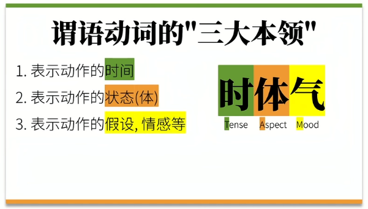

<font color=red><strong>除此之外，一句英语语句还可以包括其他成分，如主语、宾语、宾语补足语、主语补足语（即表语）、定语、状语……。</strong></font>

<font color=red><strong>而这些其他成分，都可以由非谓语动词来充当。再一步说，一个动词，作为谓语动词，只能在句中充当核心的谓语动词，而不能充当其他句子成分。如果想要充当其他句子成分，必须把这个动词转化为非谓语动词，也就是不定式、过去分词、现在分词，动名词其中之一。</strong></font>

### 5.1.3.不定式在句中充当各种成分

#### 5.1.3.1.不定式作主语


<font color=red><strong>在这里to eat是动词不定式，在句中充当主语。这个不定式表示的意思"一天吃一根胡萝卜"这个行为。那么，是谁一天吃一根胡萝卜，具体是在过去吃还是将来吃？光看到to eat，咱们还不确定。所以才是"不定式"。这个不定式，或者说行为，不受具体的人和时间限制，就是单纯在说"一天吃一根胡萝卜"这个概念。它可不是同理整句的谓语动词。既然这句话的主语是To eat a carrot every day，这句话里的谓语动词是is。</strong></font>

<font color=red><strong>在英文表达中，常常借助it来代替主语，即所谓的形式主语。</strong></font>而把to eat a carrot every day放到谓语动词之后就是：

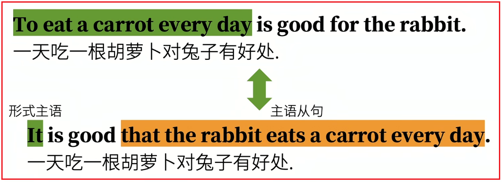

<font color=red><strong>It is + 形容词 + for sb + to do sth.其实这个句子的核心就是动词不定式，作主语时为避免"头重脚轻"的情况，借助it充当形式主语放在句首。这句话也相当于之前讲的带形式主语的主语从句。</strong></font>

#### 5.1.3.2.不定式作宾语

to eat不仅可以作主语，放在宾语的位置可以。

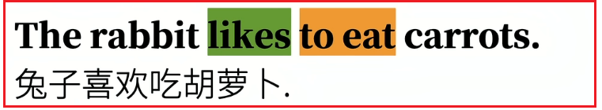

<font color=red><strong>to eat在这里做了谓语动词like的宾语，但是有的动词后面是不能接不定式做宾语的，之后讲非谓语动词中的动名词时再说。</strong></font>

前面it做形式主语的情况，那么it有没有可能做形式宾语呢，答案是可以的。

<font color=red><strong>在之前语法综述提到的复杂及物动词，如：I consider the rabbit smart。consider是个复杂及物动词，rabbit是这个动词的宾语，而smart是宾语的宾语补足语（宾补）。</strong></font>


**如果把这句话的宾语改为形式宾语，就是：l consider it important to eat a carrot every day。**

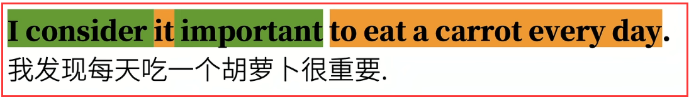

<strong>这句话说完l consider it important的时候，还不知道认为什么最重要，直到说了后面的不定式，才意识到，原来it代表是的就是不定式。</strong>

#### 5.1.3.3.不定式作宾语补语

<font color=red><strong>不定式可以和复杂及物动词一起使用。之前说过，宾补加在宾语后面，对宾语起补充说明作用。</strong></font>

比如：

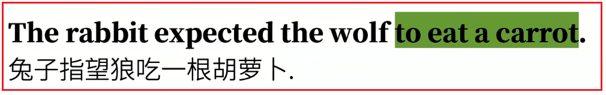

**to eat a carrot是补充说明狼的动作，或者说是兔子希望狼发出的动作。**


**有些谓语动词（如：see、find、watch及hava、make、let这类"使役"动词），后面用不定式作宾语补语需要省略to，也就是在视频开始部分提到的bare infinitive。**

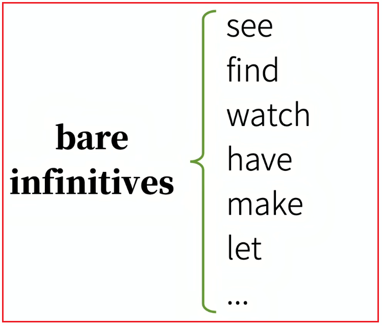

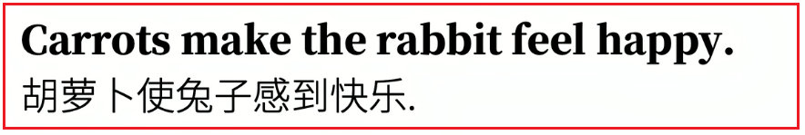

<font color=red><strong>还有谓语动词后接不定式作宾补时，省不省略to区别不大，都是正确表达。</strong></font>

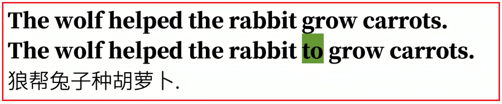

#### 5.1.3.4.不定式作主语补语（表语）

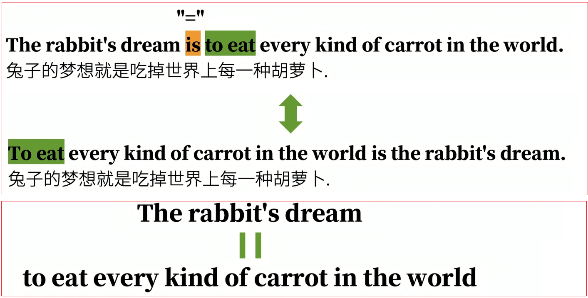

#### 5.1.3.4.不定式作定语

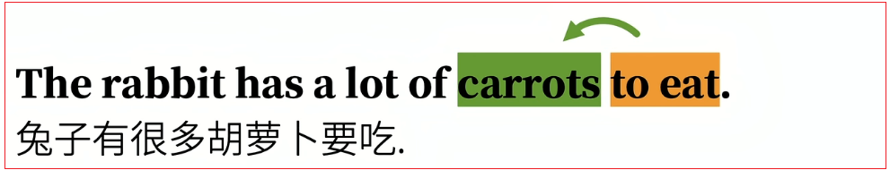

<font color=red><strong>不定式to eat作后置定语修饰carrots，表示这些胡萝卜是会被吃的，也就是说他们之间是一种动宾关系。</strong></font>

#### 5.1.3.5.不定式作状语

<font color=red><strong>不定式通过作状语表达原因、目的、结果</strong></font>

1. 表原因

   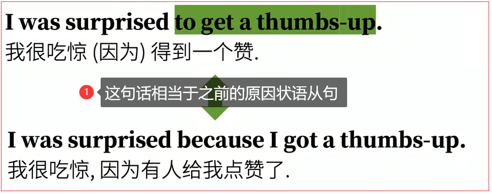

2. 表目的

   

3. 标结果

   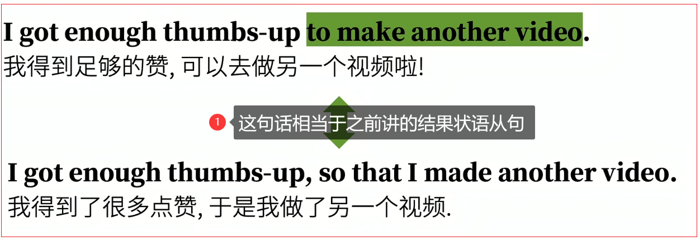

<font color=red><strong>像不定时这样的非谓语动词还有简化从句的功效。</strong></font>

### 5.1.4.高级不定时

以上是最基础的不定式的用法，更高级一点的用法，是把不定式和状态相结合。

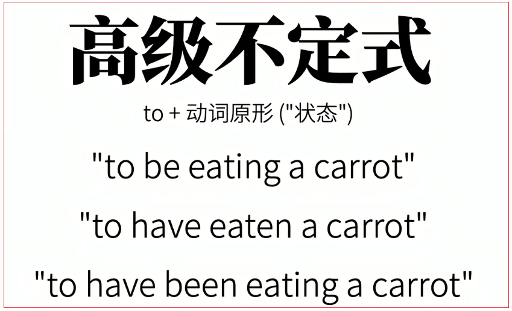

<font color=red><strong>只是把简单的to+动词原形中的动词原形增加了状态，后接助动词的原形，这里表达了状态，但是实际还是"不受时间限制的"。</strong></font>

比如：


## 5.3.动名词

<font color=red><strong>动名词名词就诠释了自己，在动词原形后加ing（有点也会重复末位字母），就能把动词转化为名词来用，也就是动名词的本质相当于名词。</strong></font>


<font color=red><strong>后面还会讲另一种非谓语动词：现在分词，它长的和动名词一样，但是用法却很不同。</strong></font>

<font color=red><strong>既然动名词相当于名词，那很自然地，名词在句中可以做成分，动名词同样可以承担。</strong></font>

### 5.3.1.动名词作主语

示例：

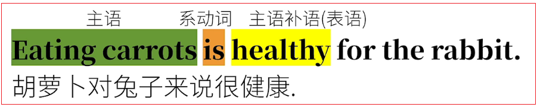

<font color=red><strong>其中，carrots是名词，做主语。如果用动名词(词组)来替换carrots。</strong></font>

<font color=red><strong>Eating carrots就是动名词短语成功地把动词eat转成了名词的性质，表达了吃胡萝卜的整个行为，相当于名词在句中作主语。</strong></font>
<font color=red><strong>在Eating carrots is healthy这句话中，Eating carrots 是主语，is是系动词，healthy是主语补语。</strong></font>

### 5.3.2.动名词作主语补语（表语）

动名词也可以做表语。
比如：

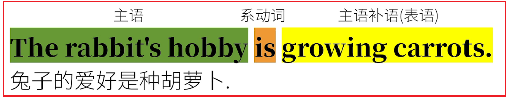

**很显然，这里The rabbits hobby是主语，is是系动词，动名词短语growing carrots是主语补语（表语）。**
**甚至有时候句中的主语和主语补语（表语）都是动名词。**

比如英语谚语：

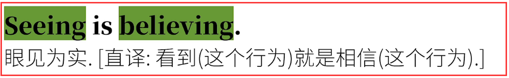

### 5.3.3.动名词作定语

**sleeping作定语，说明药片pill的用途，是为了睡眠用的，也就是for sleeping。**
<font color=red><strong>请注意，这里的sleeping是昂名词用，意思可不是pill在睡觉，这种动名词作定语的用法，很容易和后面讲的动词现在分词作定语混淆。</strong></font>

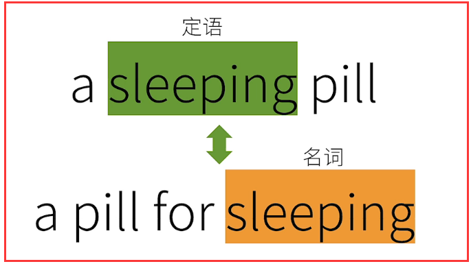

### 5.3.4.动名词作宾语

在讲不定式中，说了不定式可以做宾语。

比如：

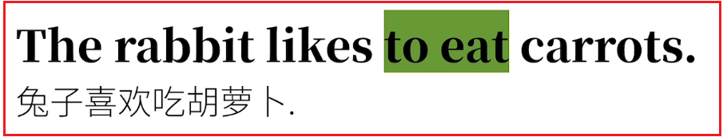

而动名词也可以做宾语

比如：


补充：

并不是任何动词不定式和动名词都可以做另一个动词的宾语。有点动词后面是不可以做不定式的。

比如：我们不可以说：

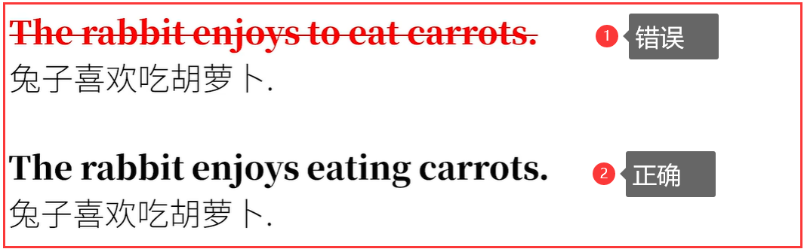

像avoid、advise、consider、escape、mind、practice等都只能用动名词
动词词组有 insist on、give up、feel like、put off等

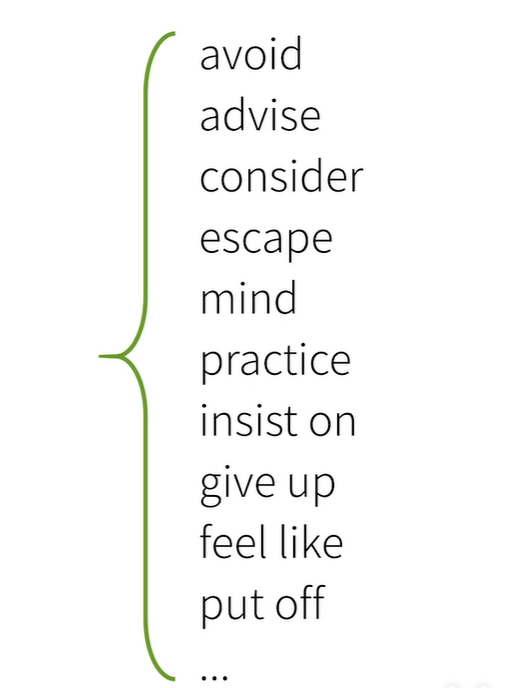

### 5.3.5.介词+宾语

<font color=red><strong>宾语除了在动词之后出现，也会在介词之后出现……，既然是宾语，就不能直接使用动词，而是要先把动词改为非谓语动词动名词。</strong></font>

比如：

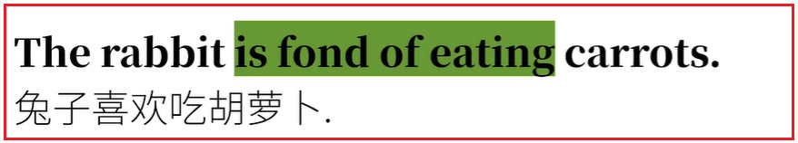

<font color=red><strong>有时你也许会遇到to作介词的词组，这个时候千万不要把它当做动词不定式的to。</strong></font>

比如：

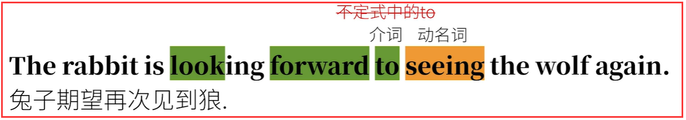

<font color=red><strong>look forward to是个动词短语，其中的to是个介词，后面跟动名词充当宾语。千万不要理解成动词不定式的to。</strong></font>

### 5.3.6.不定式和动名词区别

非谓语动词中的不定式，可以在句中充当宾语，而且动名词也可以充当宾语。可是有什么区别？

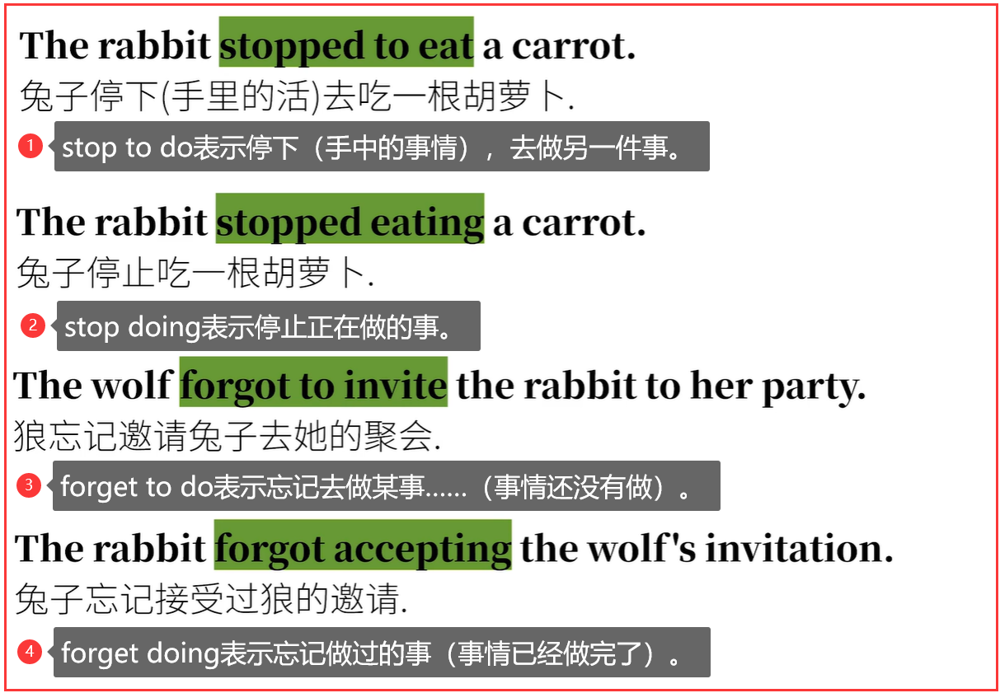

## 5.4.现在分词

### 5.4.1.现在分词简介

<font color=red><strong>在英语学习中，多半是在学习现在进行时态时解接触到现在分词的概念。即现在进行时态是由助动词be + 现在分词构成。</strong></font>


<font color=red><strong>很多人有种误解，认为现在分词顾名思义就是自带"现在时间"的属性。而这时是一个非常大的误区，咱们不能因为这个术语中有"现在"就认为它自带时间。</strong></font>

<font color=red><strong>之前说到非谓语动词（非限定性动词）是没有时间变化的；</strong></font>

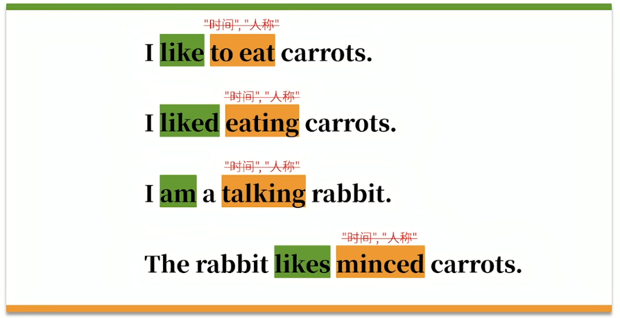

比如：

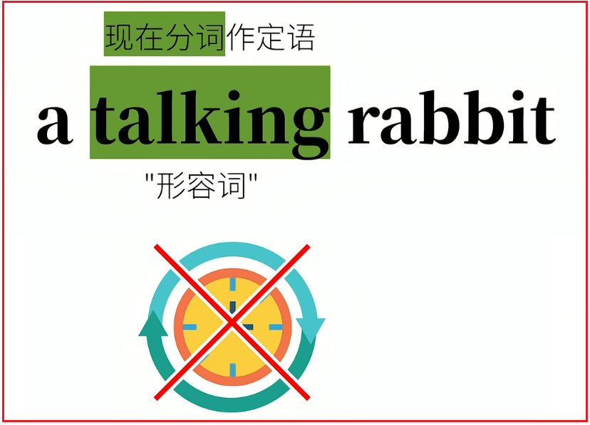

<font color=red><strong>我们基于talking只能判断出这只兔子是会说话的，但是这只兔子到底是过去在说话，还是将来在说话呢？我们不得而知，所以说,现在分词不一定自带"现在"的属性。</strong></font>

<font color=red><strong>现在分词基本属性相当于一个形容词，那么形容词在句中可以充当的成分，现在分词当然也可以。a talking rabbit中的talking就是定语。</strong></font>

但是有个问题是：之前说动名词时，动名词也可以做定语，而且动名词和现在分词长的一模一样，那到底怎么判断？
比如，我们看到一句话中或一个短语中出现sleeping，它东堤是动名词还是现在分词？

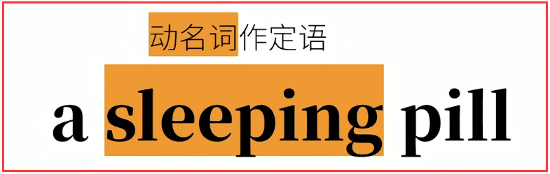

这里的sleeping是动名词，用来说明药片（pill）的性质，功能和用途，相当于：a pill for sleeping。 


例：

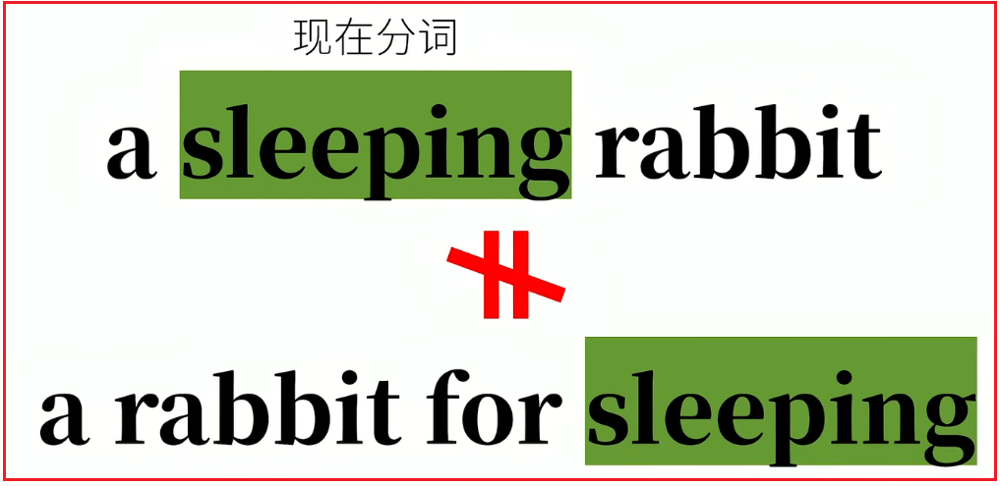

**a sleeping rabiit并不是a rabbit for sleeping.这里的sleeping表示的是一只"在睡觉"的兔子，可不是个名词，他是个现在分词，相当于一个形容词，用来修饰兔子的状态，"在睡觉"。**

**但是，如图之前说到我们只知道兔子的状态是在睡觉，至于他是昨天在睡觉还是明天在睡觉，并没有明确指出。**

### 5.4.2.现在分词作表语

<font color=red><strong>形容词可以做表语（主语补语）</strong></font>

比如

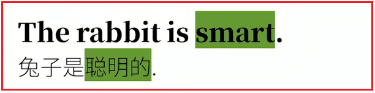

<font color=red><strong>我们可以把形容词改成一个现在分词</strong></font>

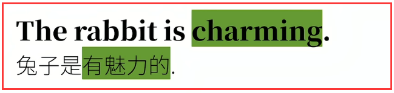

<font color=red><strong>很多平时我们挂在嘴边的，用来形容人和物的词，其实都是现在分词。</strong></font>

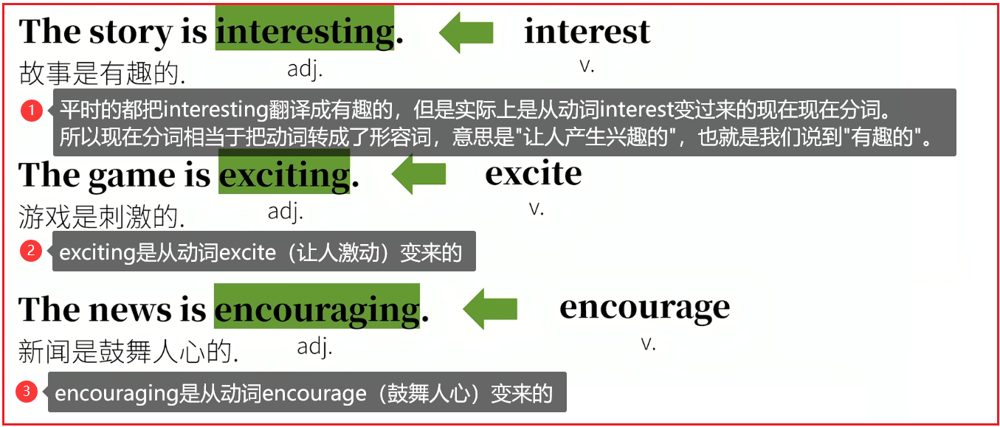

### 5.4.3.现在分词作宾语补足语

<font color=red><strong>现在分词还可以作宾语补足语</strong></font>

比如：

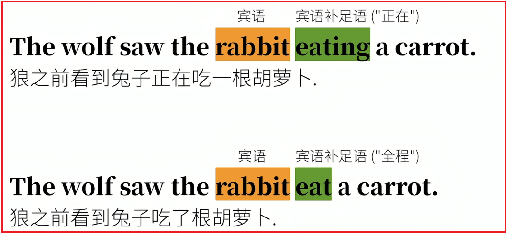

**现在分词eating作了宾语rabbit的宾语补足语，表示"兔子在吃胡萝卜"。**

之前讨论动词不定式的时候，提到过不定式作宾语补语的用法。

<font color=red>**两者的区别：**</font>

- <font color=red>**动词不定式作宾语补足语时，表示一个动作自始至终的过程，强调动作已经发生了。**</font>
- <font color=red>**现在分词作宾语补足语时，表示动作正在进行中，强调动作进行的状态。**</font>

### 5.4.4.现在分词作状语

现在分词还可以作状语，表示时间、原因、条件、结果、让步、目的、方式和伴随情况等。

比如：

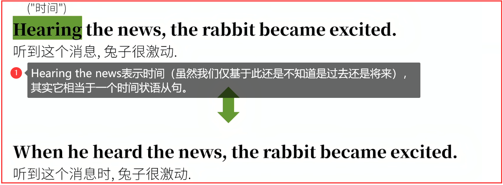

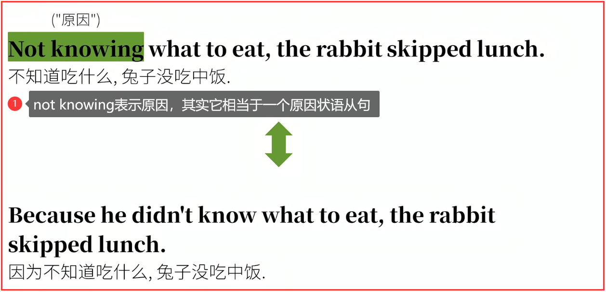

<font color=red><strong>现在分词做状语跟相对应的状语从句之间，有一种剪不断理还乱的关系？其实，非谓语动词在很大程度上简化了从句，使句子言简意赅。</strong></font>

## 5.5.过去分词

### 5.5.1.过去分词简介

<font color=red><strong>表示过去的时间这一误区中了。过去分词是非谓语动词，他不能自带时间，不能表示过去的时间。</strong></font>

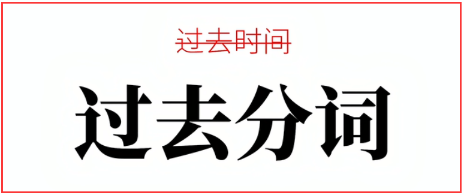

比如：

minced meat绞肉，所以minced carrot就是绞胡萝卜。

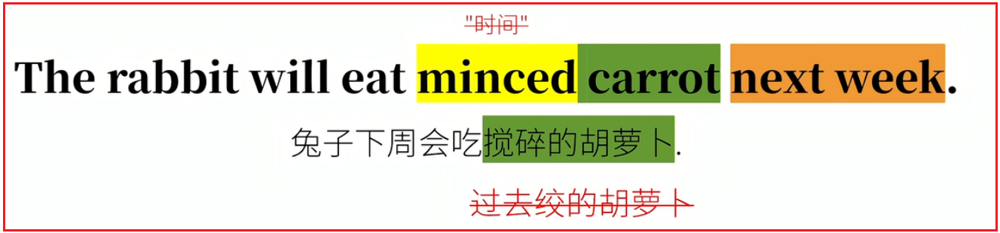

**总不能理解为"兔子下周要吃过去（今天之前）绞的的胡萝卜"吧？岂不是要吃坏肚子？也就是说minced是不自带时间概念的，而只是表示被绞的这个状态。**

<font color=red><strong>这里注意一点，mince的过去分词是minced，过去分词常见的结构是动词原形+ed，但实际上，很多常见的过去分词都是不规则的，其实还是有迹可循的。可以参考www.yingyutu.com/bgz</strong></font>

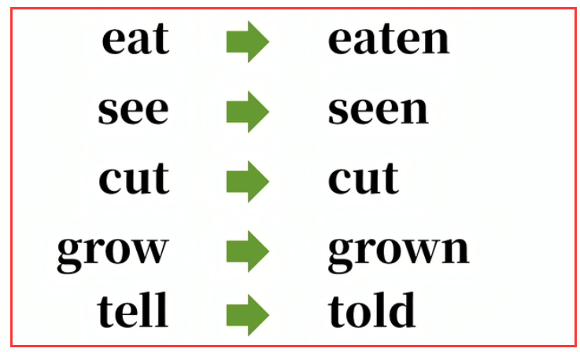

### 5.5.2.过去分词作定语


<strong>在的minced meat和minced carrot中，minced作定语，可以把这个过去分词看做形容词。</strong>

通过的形容词，比如big、small、smart都是加在名词前的。

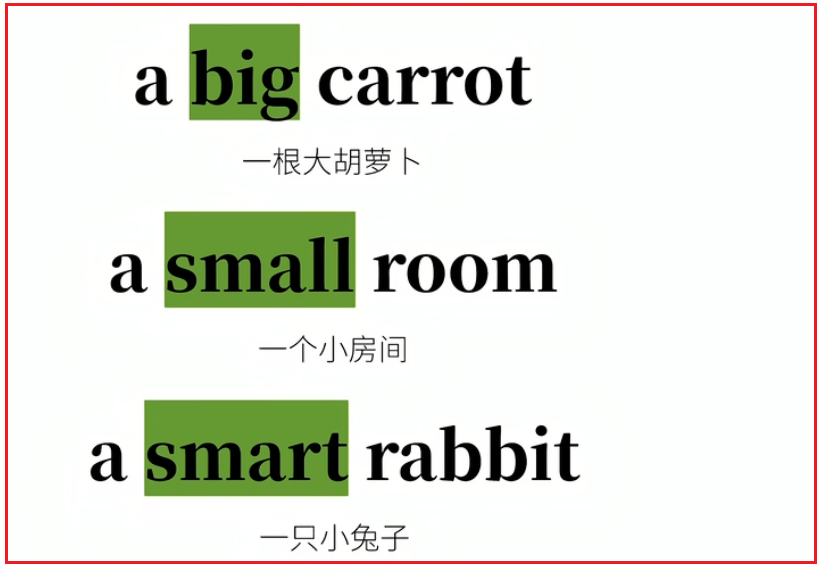

单个过去分词也是一样。

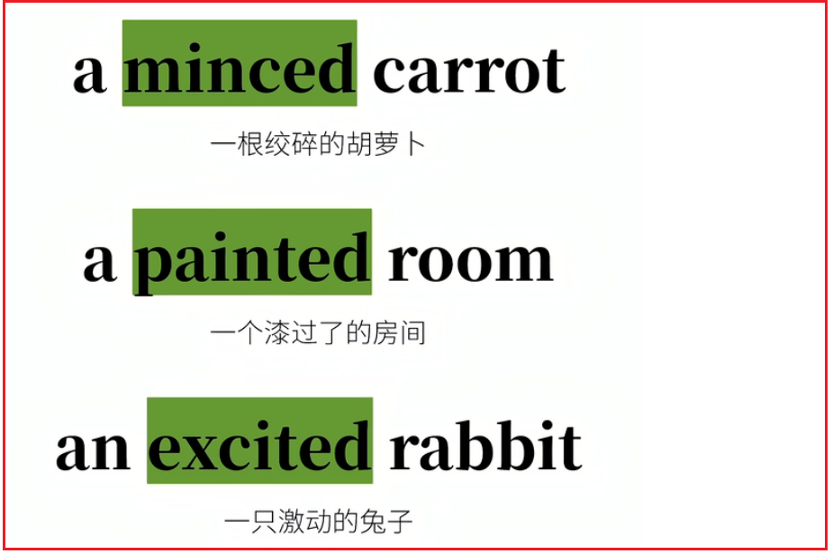

### 5.5.3.后置定语

<font color=red><strong>过去分词短语作定语，则要放到被修饰的名词之后，即很多语法书说到"后置定语"。</strong></font>

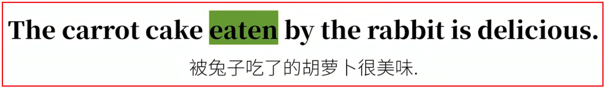

### 5.5.4.过去分词作主语补语（表语）

<font color=red><strong>和现在分词一样，过去分词也可以充当主语补语（表语）。</strong></font>

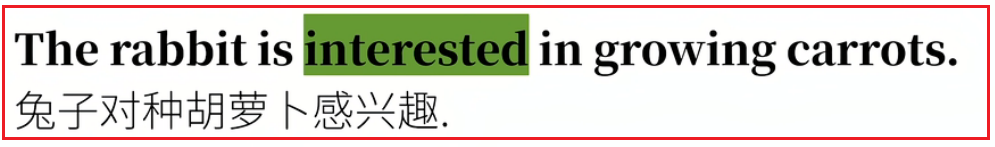

**这里的interested就是一个过去分词，表示"对……感兴趣的"。就是经常说到sb is interested in doing sth.就是一个有着过去分词的主系表结构。**

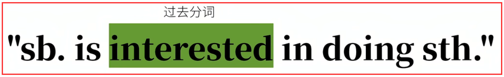

而且这里还有个动名词，之前说现在分词时说过现在分词也可以做主语补语（表语）


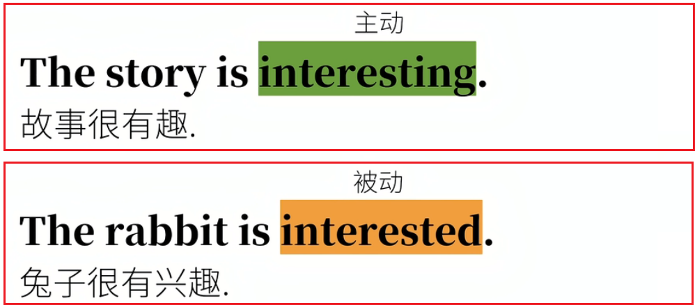

过去分词和现在分词都可以做表语，两种不同分词作主语补语（表语）的区别。

- 现在分词暗含主动关系，即被描述的是做出动作的人/物。the story is interesting暗含的意义是故事让人感到有兴趣。
- 而过去分词暗含被动关系，即被描述的是动作的接受者，the rabbit is interested……暗含的意义是，兔子被某事物引起了兴趣。

补充说明：

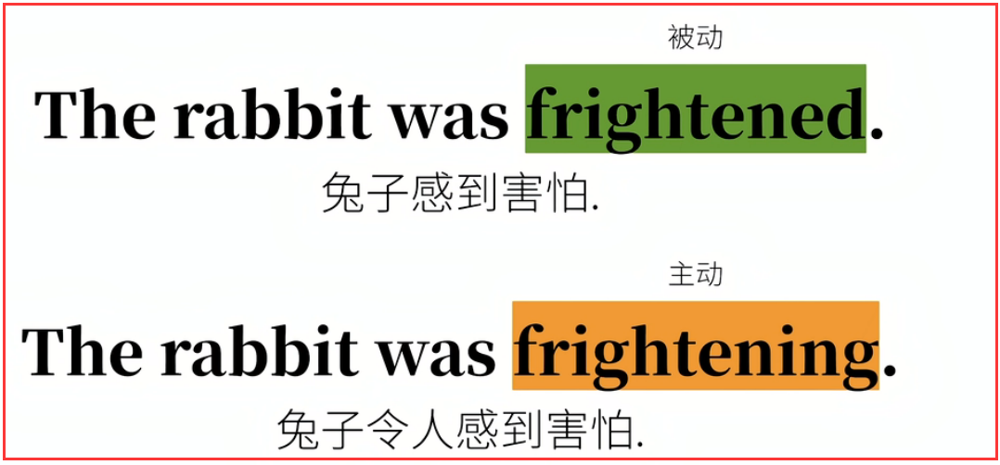

**兔子感到害怕，说明是被动的，被某事吓到了，所以要用过去分词，即sb is interested(过去分词) in doing(动名词) sth。**
**如果兔子主动去吓人，才用现在分词，表示"令人害怕的"。**

<font color=red><strong>所以不要笼统的认为"过去分词修饰人，现在分词修饰物"，要搞清楚是主动还是被动。</strong></font>

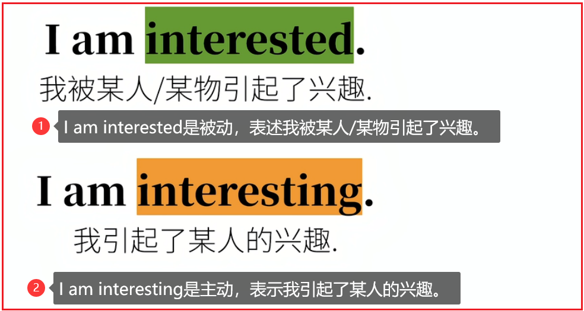

### 5.5.5.过去分词作宾语补语

<font color=red><strong>复杂及物动词后跟宾语和宾语补语，而这个宾语补语也可以由过去分词充当。</strong></font>

比如：

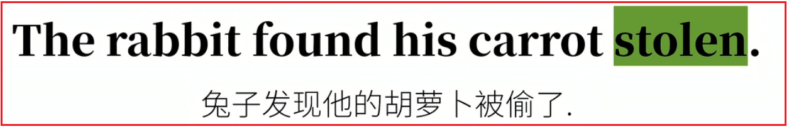

### 5.5.6.过去分词作状语

#### 5.5.6.1.简介

<font color=red><strong>过去分词也可以做状语，这一点和现在分词相似。</strong></font>

1. 表地点

   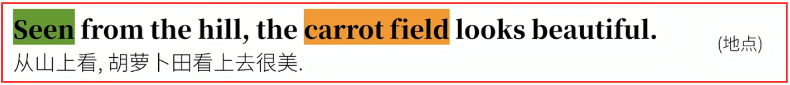

   主语carrot filed是seen的逻辑主语，他们之间是一种被动关系，所以使用过去分词。

2. 表原因

   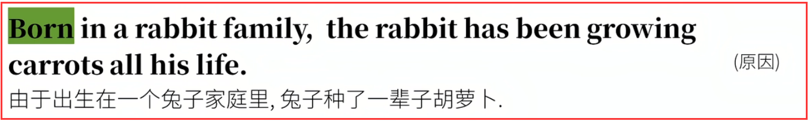

3. 表条件

   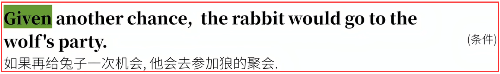

#### 5.5.6.2.过去分词和现在分词用法区别

以上这些用法也容易和现在分词混淆，比如有人也许会问，是否可以说

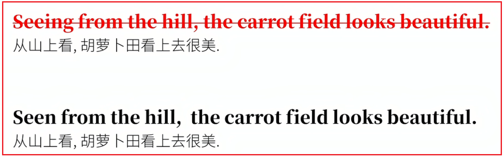

<font color=red><strong>要弄清楚到底是该用过去分词还是现在分词，还是看句子中到底是主动含义还是，被动的含义。</strong></font>

**这里的胡萝卜田到底是被看还是主动去看别人？**
**很显然是被动，所以是seen from the hill，从山上被看。**

**如果是一只兔子主动去看什么东西，才是：**

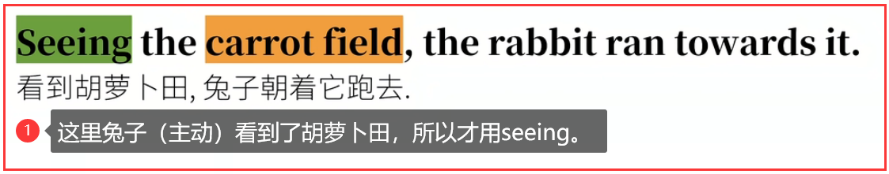

#### 5.5.6.3.过去分词的"高级"用法

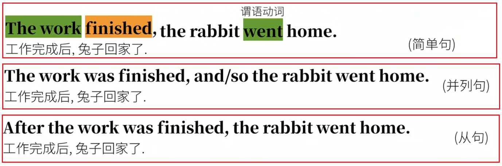

**finished并不是在描述后面的rabbit，而是在描述the work。所以这句话实际上相当于并列句，或者从句。**

**以上这种"高级"用法,就是让句中只含有一个谓语动词，其他的变成非谓语动词，用一个简单句写出来。**
**所以The work finished, the rabbit went home.这句话是一个简单句，其中唯一的谓语动词是went，而另一个动词finished则是以过去分词的形式出现。**

示例：

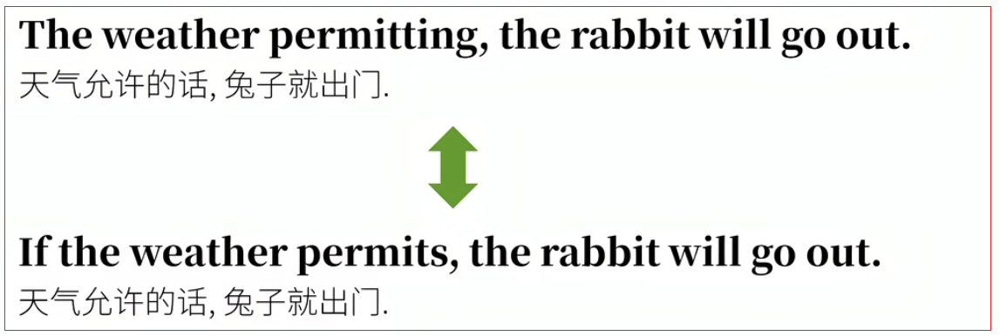

#### 5.5.6.4.独立主格

<font color=red><strong>以上这种一个简单句除去句子核心的谓语动词外，其他的动词转化为对应的过去分词或者现在分词的用法，语法上称作"独立主格"。</strong></font>

为什么叫做独立主格？

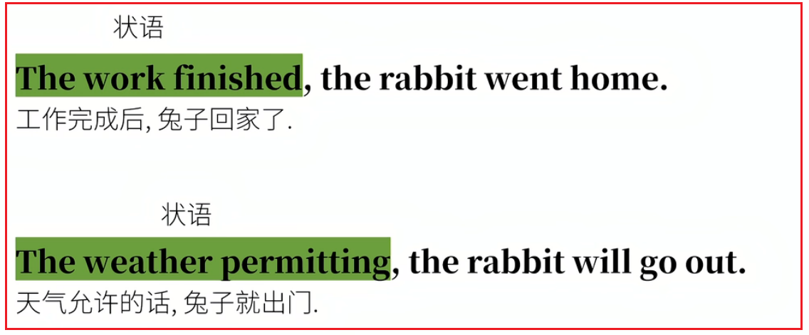

**因为在以上的这种句子中，现在分词/过去分词是句中的状语（并非句子的主语），但是在状语本身里，分词修饰的对象（以上句中的work和weather），隐含了一层"主语"的意味，虽然并不是整句的主语。**

```html
<strong></strong>
<font><strong></strong></font>
<font color=red><strong></strong></font>
<font color=red> </font>
```

