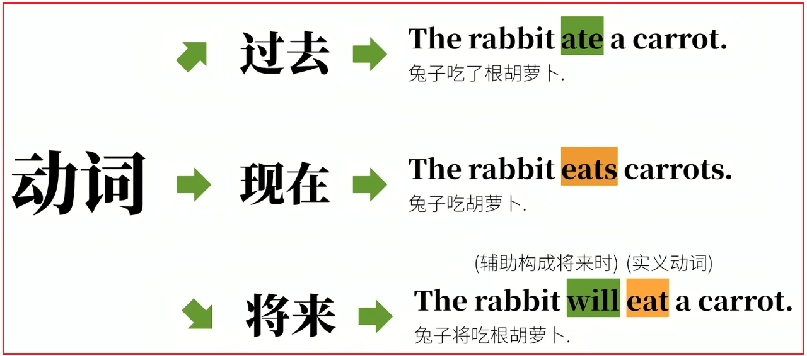
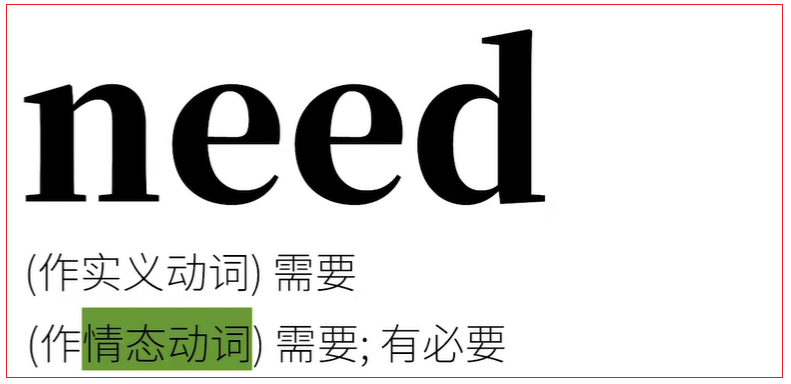

# 6.助动词

<font color=red><strong>助动词（auxiliary）中最重要的就是情态动词（modal verbs）</strong></font>

有点语法书会讲助动词和情态动词分为不同的两类。

## 6.1.什么是助动词

<font color=red><strong>之前的语法综述提到，任何足迹都分主语和谓语，而谓语部分的核心是谓语动词。但是，谓语动词本身往往无法独立表达某些语法概念，需要其他词的复杂。</strong></font>
<font color=red><strong>而这些来辅助构成谓语但自己本身不能作谓语动词的词就是助动词。</strong></font>

举例说明：

<font color=red><strong>动词有过去式、现实时、将来时。eat这个动词本身有过去式的变位（ate），（第三人称）现在式变位（eats），但其实并没有将来式变位，即eat本身是没有办法通过动词变位，即改变拼写，来表达"将来时"的。</strong></font>

eat怎么才能表达"将来时"?
**必须在前面加wil来"辅助"完成表达，所以，will在这里就是构成将来时的助动词，而助动词will本身，是不能独立表达完整句意的，必须把实义动词加上**。



对比法院：


补充说明：英语中存在一些不用助动词也能表达将来的语法


## 6.2.助动词两个基本特征

- <font color=red>**辅助助动词**</font>
- <font color=red>**不能像助动词那样独立作谓语动词**</font>


<font color=red><strong>虽然can这样的词被很多语法提醒归类为"情态动词"，但是情态动词1.起辅助主动词的作用，2.不能单独作谓语动词。所以说到底can这样的情态动词是助动词的一种，也可称作"情态助动词"</strong></font>

那么，为什么有些语法体系把情态（助）动词单独归为和助动词并列的一类词呢？

**这是因为，这些语法体系认为，助动词只是起"辅助"作用，本身不该含有实际意义，而像can这样含有实际意义的词，应当被区分开来。这样说也并非没有道理，所以助动词和情态动词区分开来也不是不行，只不过，基于"是否辅助主动词来构成语法概念"和"是否能单独作谓语动词"这两条，更赞成把情态动词归为助动词的一类。称呼情态动词或者情态助动词都可以。**

## 6.3.助动词分类的应用


### 6.3.1.基本助动词


#### 6.3.1.1.be


#### 6.3.1.2.hava


#### 6.3.1.3.do


### 6.3.2.情态助动词的应用

**相比基本助动词，情态助动词就要复杂一些了。**

#### 6.3.2.1.can/could

1. 表能力

   <font color=red><strong>can/could可以表示"有能力做某事"，也可以译作"会"，"可以"，但是注意"会"在中文里还能表示"将要"，而"可以"还能表示"许可"，与这里的"能够"有区别。</strong></font>

   

2. 表请求或许可

   <font color=red><strong>刚才说到can/could也可以表示"可以"，中文的"可以"是多义词，除了表示有能力，也表示"许可"，所以不要和刚才那种"能够"的含义混淆。</strong></font>

   

   

3. 表可能性

   

   

#### 6.3.2.2.may/might

1. 表请求或许可

   <font color=red><strong>和can/could可以表达请求一样，may/might也是这个意思。</strong></font>

   

   

2. 表可能性

   <font color=red><strong>may/might表可能性的程度小于can/could的可能性。所以翻译为"也许、大概、可能"。</strong></font>

   

   

3. 表祝愿

   <font color=red><strong>may还可以表示祝愿，通常放在句首；</strong></font>

   

#### 6.3.2.3.must

1. 表必须

   <font color=red><strong>表必须这是must的基本意义</strong></font>

   

2. 表禁止

   <font color=red><strong>当must加上not（或者缩写为mustn't），就有了"不准、禁止"的意思。</strong></font>

   

   

   

3. 表推测

   <font color=red><strong>must还能表示"一定、肯定"，must表示推测是只能用在肯定句里，否定句就只能用can't。</strong></font>

   

#### 6.3.2.4.will/would

1. 构成将来时

   

2. 表示请求，建议

   

3. 表推测，假设

   <font color=red><strong>will和would也可以表示推测</strong></font>

   

   

#### 6.3.2.5.shall

<font color=red><strong>shall/should的含义较多，所以挑最重要的说。另外should是shall的过去式，但是两者含义区别较大，所以分开说。</strong></font>


1. 构成将来时

   <font color=red><strong>Shall可以构成将来时，这一点和will相同。</strong></font>

   

2. 表请求或者征求意见

   <font color=red><strong>shall可以用来征求意见</strong></font>

   

3. 表警告，命令等

   

#### 6.3.2.6.should

1. 表应当

   

2. 表有一定根据的推测

   

   <font color=red><strong>这里的推测是根据具体情况做出的推测，所以表示的可能性程度比较大。</strong></font>

3. 表"竟然"

   

4. 构成虚拟语气

   <font color=red><strong>这种情况一般会出现在条件状语从句中</strong></font>

   

#### 6.3.2.7.ought to

<font color=red><strong>表示"应该",与should在表示应该时的用法大致相同，但往往语气更强一些。</strong></font>


#### 6.3.2.8.need



<font color=red><strong>need最常见的用法是作实义动词，表示需要。</strong></font>

如：


<font color=red><strong>need也可以作为情态动词，也表示"需要，有必要"。不过，既然是情态动词，那就要遵循情态动词的行为守则。</strong></font>


#### 6.3.2.9.dare


<font color=red><strong>dare和need类似，也可以从实义动词转化为情态（助）动词。dare作为情态助动词，表示"敢"，一般用于否定句和疑问句。</strong></font>


#### 6.3.2.10.used to


<font color=red><strong>表示过去的动作，used to表示过去的动作，尤其是重复的动作，而且强调和现在的对比。</strong></font>
如：


### 6.3.3.半助动词的应用

#### 6.3.3.1.be able to

<font color=red><strong>这个半助动词和can很像，但是有些区别。can的时态只是现在与过去时，所以一般表示的是现在和过去的能力。而be able to可以表达将来的能力。</strong></font>


#### 6.3.3.2.be going to、be about to、be to

<font color=red><strong>这三个半助动词和will一样都表示将要做某事，但是语境有些微妙的区别。</strong></font>


1. be going to

   

2. be about to

   

3. be to

   

#### 6.3.3.3.had better

<font color=red><strong>had better表示"最好做……"，往往表示忠告，警告之意。暗含"如果不这样作，会有不好的后果"。</strong></font>


```html
<strong></strong>
<font><strong></strong></font>
<font color=red><strong></strong></font>
<font color=red> </font>
```


