# 7.独立主格

<font color=red><strong>前面讲非谓语动词中的过去分词时提到非谓语动词</strong></font>

## 7.1.独立主格简介

1. 过去分词

   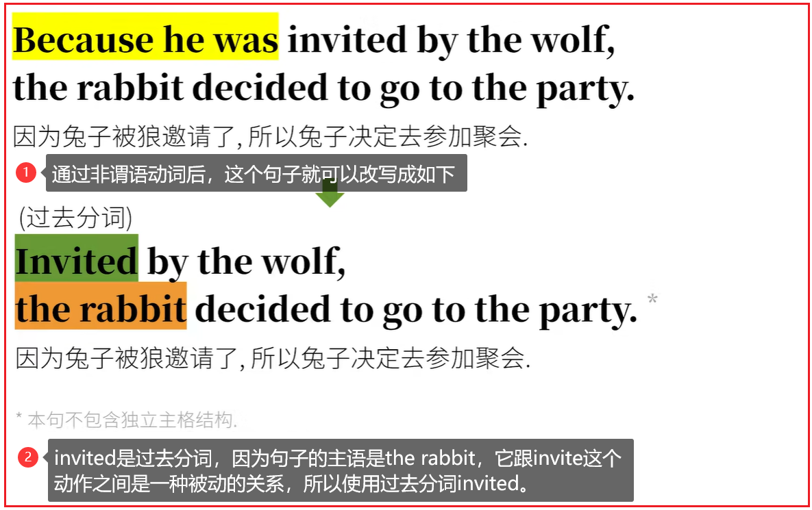

   <font color=red><strong>相比较之前的句子，省略了because he was这一部分，却同样表达了原因这一目的，从而是这个句子达到了简化的效果。</strong></font>

2. 现在分词

   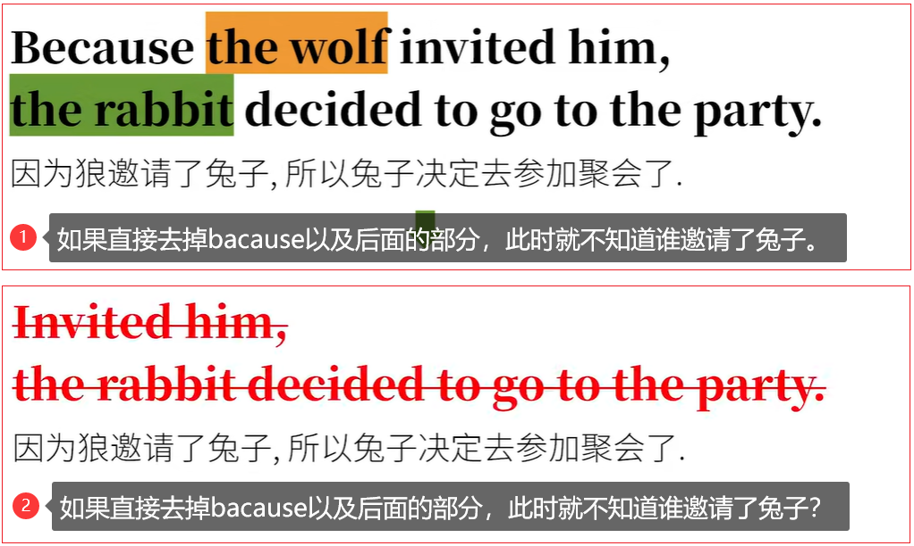

   <font color=red><strong>这个句子的主干是The rabbit decided to go to the party,而前面the wolf inviting him中，invite这个动作是由the wolf发出的，而不是真正的主语the rabbit发出的动作。所以语法上把the wolf称为动词invite的逻辑主语。而这就是"独立主格"的"主格"。</strong></font>

   **那独立如何理解？**

   <font color=red><strong>因为the wolf是游离于真正的主语the rabbit之外的，在the wolf inviting him中"独立"出来了。</strong></font>

   <font color=red><strong>不过这个独立的主语还是不能跟真正的主语相提并论，要不怎么说是"独立主格"，而不是"主力主语"。</strong></font>

## 7.2.独立主格结构对从句的简化

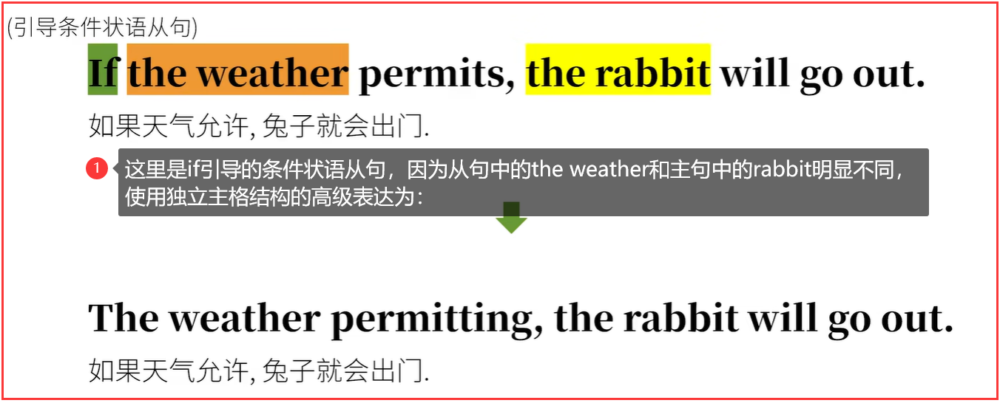

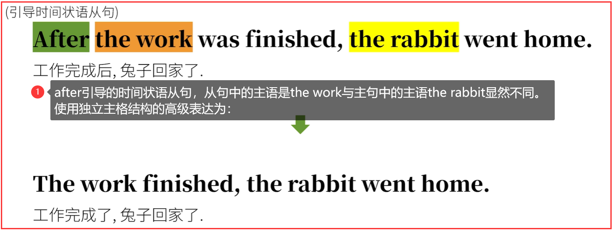

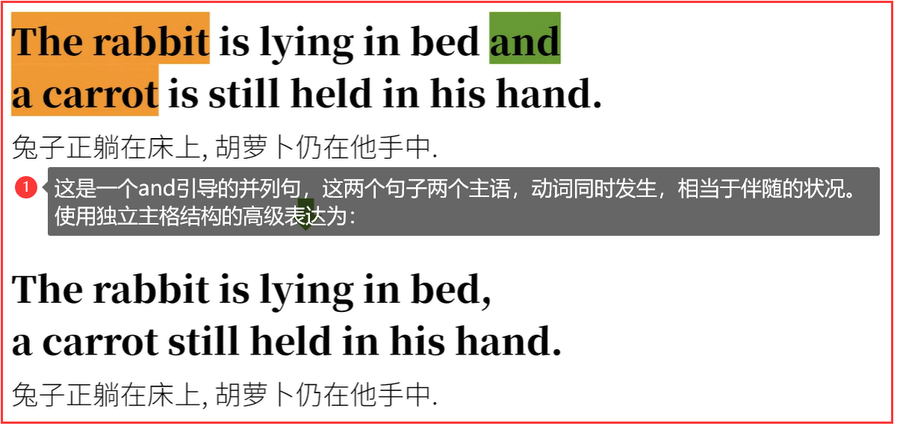

## 7.3.独立主格的种类

<font color=red><strong>前面说了那么多，实际只是独立主格的两种形式</strong></font>

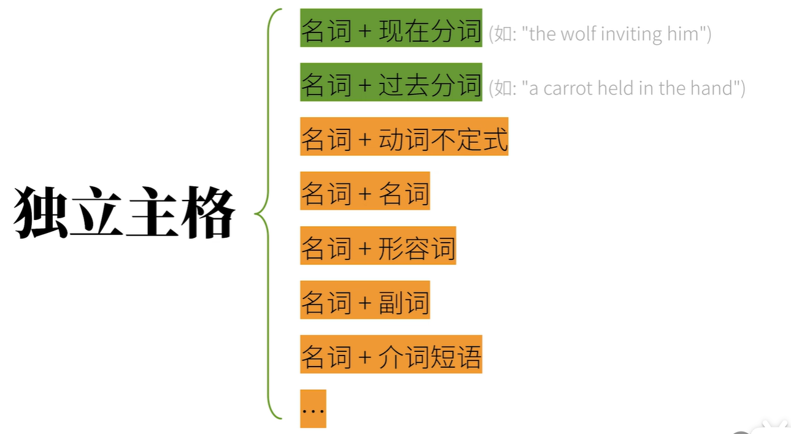

### 7.3.1.名词/代词 + 动词不定式

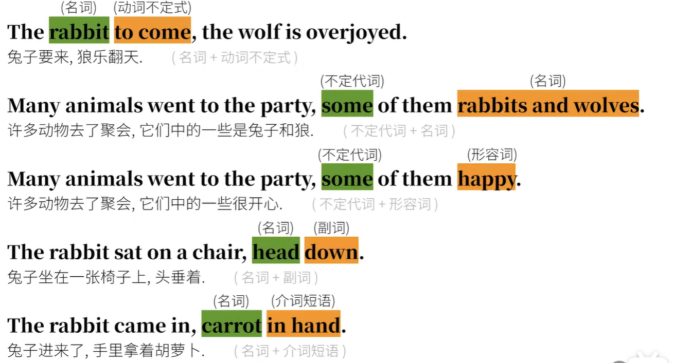

### 7.3.2.名词 + being + ……

<font color=red><strong>实际上他们更像是：包含be动词的独立主格，也就是名词/代词 + be动词的现在分词being，然后再把being省略掉。</strong></font>

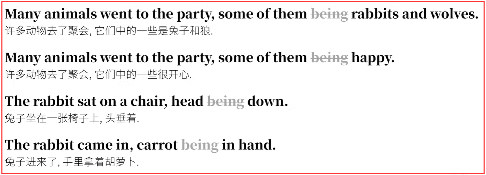

### 7.3.3.独立主格结构

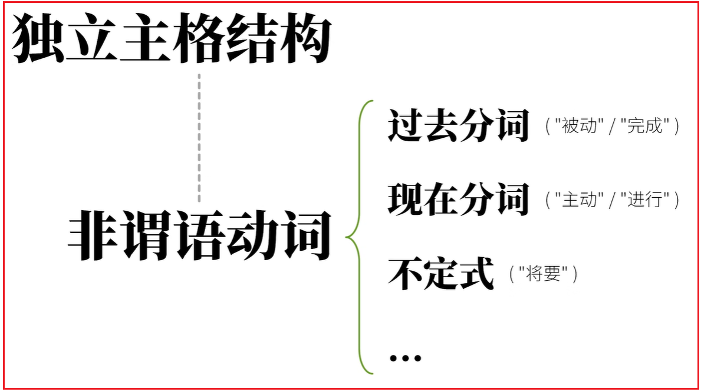

在学习独立主格主要形式时，其实还是不能脱离非谓语动词这一概念。

- 过去分词表示逻辑主语和动词是一种被动，完成的关系；
- 现在分词表示逻辑主语和动词是一种主动，进行的关系；
- 动词不定式表示逻辑主语将要发生的动作；
- 而其他的形式，更像是省略了现在分词being的一种简化形式；

所以要想学会独立主格一定要把非谓语动词的基础打好。

### 7.3.4.with + 宾语 + 宾语补足语

<font color=red><strong>经常会见到with+宾语+宾语补语这样的复合结构，其实with结构是个很重要的独立主格结构。</strong></font>
比如：

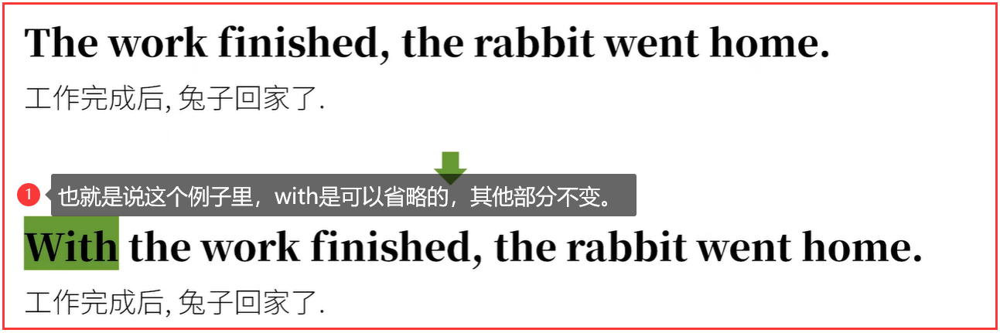

<font color=red><strong>但是通常英语独立主格省略with后，甚至会进一步简化句子。</strong></font>

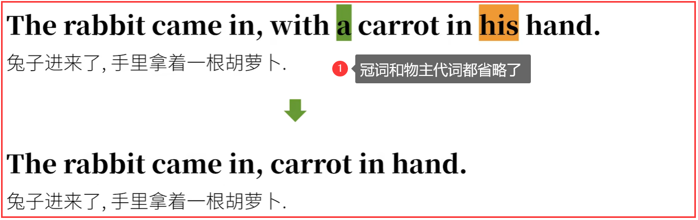

```html
<strong></strong>
<font><strong></strong></font>
<font color=red><strong></strong></font>
<font color=red> </font>
```

