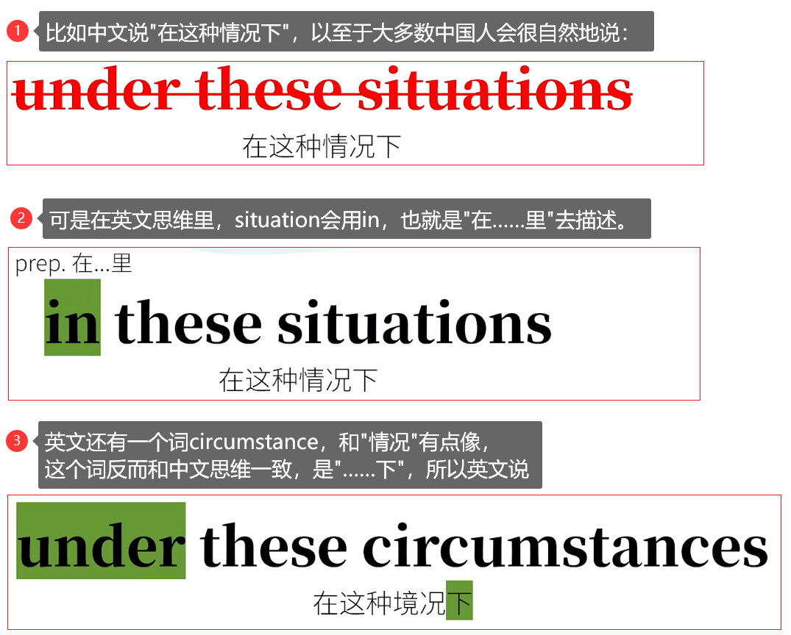
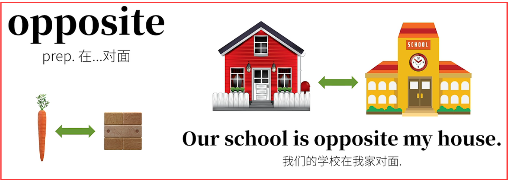

# 8.词性

## 8.1.介词

### 8.1.1.介词简介

英语介词可以说是最让人抓狂的一类词。名词和动词在现实世界里往往看得见摸得着，但是介词不一样，往往抽象并难以理解。


介词可以说是英语中追常见，最重要的一类词。牛津英语词典对单词做出分析后，得出结论最常见的25个英语单词里有10个是介词。这里当然不是说介词占英语词汇的40%那么夸张，而是说介词在英语中的使用频率超级高。虽然数量不多，但是学好他们性价比极高。


### 8.1.2.介词的原理

其实"介词"这个术语本身就有点让人摸不着头脑。

介词preposition就是通常放置在名词，代词等之前，用来给他们增添"附加信息"的词。

那"附加信息"包括哪些呢？


**因为介词不同，表达的附加意思都是不同的。**

中文示例：

1. 介词补充时间信息

   

2. 介词补充空间信息

   

3. 介词补充逻辑信息

   

英文示例：


<font color=red><strong>这样的介词表达，归根结底，都是作为某个内容的"前置词"，通过与其之后的内容关系，来表达某种信息。这便是介词的原理。</strong></font>

<font color=red><strong>正因此，完整的信息必须要有介词之后的部分参与。如果仅仅只有介词，因为与之后的内容关系缺失，自然也表达不来完整的信息。这也就是为什么介词不能单独作为句子成分存在的原因。</strong></font>

### 8.1.3.介词的构成形成


<font color=red><strong>我们理解了"所谓介词"，不过就是'前置词'而已"。那我们接下来就不难理解介词构成形式多种多样，因为就是放在其他信息之前建立关系的。</strong></font>

介词的构成形式：

1. 简单介词

   **最常见的英文介词，是单个词。**

   

2. 短语介词

   **介词还可以和其他类的词共同构成短语介词，即一个短语充当介词的功能。**

   

   <font color=red><strong>特别注意：这里的"短语介词"和后面说到"介词短语"是不同的概念，短语介词相当于介词，不能单独表示完整意思；而介词短语已经是完整的意思了，往往相当于副词。</strong></font>

3. 合成介词

   **还有介词可以相互合成**

   

4. 分词介词

   **还有一类介词是由动词的分词充当。也就是说，这些原本是动词的词，"变个形"，就是了介词的功效。**

   

<font color=red><strong>介词之所以这么多样，就是因为介词本质上不过是"前置词"，和后面的信息构成关系而已，所以既然以上这些结构形式都能满足这一点，所以都可以充当介词。</strong></font>


### 8.1.4.学习介词的误区

<font color=red><strong>正因为几次是作为"前置词"，通过与之后的内容关系来表达信息的，所以当这样的关系在中英文里的思维方式相似时，中英文介词有些对应程度很高。</strong></font>
比如：


<font color=red><strong>反之，当介词使用时中英文思维方式不同时，就没有办法找到完全对应的介词翻译。这一点和名词、动词等实词往往能够找到对应翻译很不同，比如兔子和rabbit可以说是找到对应的。但因为英文中的某些介词，比如in、on、with……恰恰英文常用，出现频率很高，所以引申义很多，导致有很多中文无法对应上的含义，无法用"里面"，"上面"，"和"，字面上对应。</strong></font>


**换句话说，学习英语介词，最忌讳的，最需要避免的，就是拼命去找个中文介词对号入座，因为那是不可能的。**


**学习英文介词最常见的问题就是：**

**为啥某介词既可以是A这个意思，又可以是B这个意思，还可能是C、D、E……**

比如：By


<font color=red><strong>而以上就是造成这些困扰的根源，其实不是"介词"的问题，而是"多义词"的问题。任何语言中，越是常用的词，往往意思越多。</strong></font>
就拿中文的"打"字举例：


<font color=red><strong>千万不要试图把中文介词和英文介词一一对应着生搬硬套.</strong></font>



### 8.1.5.学习介词的诀窍

学习英语介词有两个很大的麻烦

1. 很多介词意义太多，同一介词出现在不同的分类里，也就是说可以和之后的内容构成不同类别的关系，从而表达差别很大，甚至表达毫不相干的含义。

   

2. 很多介词相互之间易混淆，在同一个类别里的介词有时间看起来很像。比如in、on、at都可以表示时间或空间信息。这就导致非母语人士往往觉得他们过于相似，从而弄混淆。

#### 8.1.5.1.介词意义太多的问题

要解决，或者说缓解这两大问题，我们往往要从介词的本义，以及引申义入手。具体说来，介词的本义，也就是根源意义，通过能表达明确的空间含义，而在这些空间含义的基础上，又引申除了许多非空间的"衍生含义"。


举例：about

about这个介词，原来在古英语里是onbutan（相当于on by utan）。最后这里是outside的意思，所以about原意是on the outside of即"在……的外面(之处)"。这也是这个介词最原始，最根源的空间含义。


这个"在……的外面(之处)"接着就引申出了一下一系列相关的含义。

比如：


即使介词的某些含义的确会和本源的空间含义差别较大：比如介词in


所以说某些介词虽然看上去有着风马牛不相及的含义，但实际上往往都是从根源的、有着空间性的含义引申出来的。


<font color=red><strong>所以说某些介词虽然看上去有着风马牛不相及的含义，但实际上往往都是从根源的、有着空间性的含义引申出来的。</strong></font>
<font color=red><strong>不过话说回来，每个介词的每个含义都硬是从空间含义去推导也不太现实，或者说往往很牵强。有事这种"推导"更像是记忆技巧。以上说的是介词"多含义"这个难点。</strong></font>

#### 8.1.5.2.某些介词之间易混淆

某些介词之间容易混淆也可以用刚才这种追本溯源的方法来缓解。

比如，in、on、at都能前置与时间和空间、表达相关含义。正是因为这样，很多人老是记不住。


**如果从这三个介词的空间含义入手。**


1. at the cornor，at the shop（应为角落、商店很明确，不会到处移动）

2. in the city，in the country（因为在城市和国际里可以大范围移动）

3. 那么，the street前是at，on还是in呢？这取决于你要表达的含义。

   


把空间概念引申到时间上


千万不要教条主义地认为，看见hour就一定要用on。一定要想清楚，我们要表达的是一个范围，还是具体一个点。
比如我们说一个小时里有六十分钟。肯定是把小时和分钟比较，即分钟是在小时的范围里，这里的hour显然不是一个点。

所以：


有人好奇为什么是in the morning?
morning比day范围小，问题就出在，当我们使用in the morning这个短语时，通过是表达一个时间段的范围，相当于刚才的There are 60 minutes in an hour.

所以当说


我在早晨这个时间范围里吃胡萝卜，而如果要表达的是相当明确的一个点，就要说on the morning了。

比如说


这里要表达的意思是在四月一日早晨这个时间，和一天差不多的范围。

### 8.1.6.表示空间的介词


#### 8.1.6.1.in

**表示"在……里面"，表示在一个空间的内部。**


#### 8.1.6.2.on

**表示"在一个物体表面上"。**


**其实on在古英语里是in的另一种形式，所以往往和in的含义有交叉。只不过在现代英语中on做空间介词是在某个面之上的含义。**

在此注意一下on the tree和in the tree的区别


#### 8.1.6.3.at

**at在表示某地点的时候，指一个确定的具体的"点"。**


#### 8.1.6.4.over

**当over做空间介词时，表示"在……上方"，这个"在……上方"，有可能接触，也可能不接触。**

1. **如果表示物体与物体接触的话，一般表示"覆盖，全部遮住"的意思。**
2. **如果不与物体接触的话，表示"在……的正上方"。**
3. **更常见的是表达上空这个含义over是表示一个动态的"越过上空"。**


#### 8.1.6.5.above

**表示"高于某个平面之上"**


#### 8.1.6.6.on、over、above的区别

**on，over，above这几个词都有表示"在……上面"的含义，但是是有区别的；**


#### 8.1.6.7.under

**表示"在……下方"，与over相对；**


#### 8.1.6.8.below

**表示"在……下方"，与above相对；**


#### 8.1.6.9.under和below的区别


#### 8.1.6.10.near


#### 8.1.6.11.by、beside


#### 8.1.6.12.next to


#### 8.1.6.13.near、by、beside、next to区别


#### 8.1.6.14.across


#### 8.1.6.15.through


#### 8.1.6.16.past


#### 8.1.6.17.in front of


#### 8.1.6.18.before


#### 8.1.6.19.behind


#### 8.1.6.20.between


#### 8.1.6.21.among


#### 8.1.6.22.round/around


#### 8.1.6.23.along


#### 8.1.6.23.to


#### 8.1.6.24.toward/towards


#### 8.1.6.25.onto


#### 8.1.6.26.into


#### 8.1.6.27.out of


#### 8.1.6.28.opposite



#### 8.1.6.29.against


#### 8.1.6.30.up


#### 8.1.6.31.down


#### 8.1.6.32.off


### 8.1.7.表示时间的介词

不少表示时间的介词和他们表示空间的"本源"用法是对应的，之前讲过in,on,at表示的时间范围是由大到小的。


#### 8.1.7.1.in

<font color=red><strong>in本意是"在……里面"，在范围相对大的时间内。</strong></font>


<font color=red><strong>in the morning</strong></font>

#### 8.1.7.2.on

<font color=red><strong>on的本意是"在……之上"，范围相对就小一些。一般表示在具体的某一天。</strong></font>


#### 8.1.7.3.at

<font color=red><strong>at因为空间范围很小，所以引申到时间上也类似，表示非常确定的时间点。一般说几点钟用at。</strong></font>


#### 8.1.7.4.during

<font color=red><strong>during本意就是"持续"，表示持续一段时间。</strong></font>


#### 8.1.7.5.for

<font color=red><strong>for在古英语里有"之前，由于"的意思，作"非时间介词"时一般和原因相关。在这里做时间介词，可以引申为"(因为……)持续"；</strong></font>


#### 8.1.7.6.since


#### 8.1.7.7.before

<font color=red><strong>before一般就是用于表示时间（以及次序）的"在……之前"；</strong></font>


<font color=red><strong>注意before很少用于空间的"在……之前"。</strong></font>

#### 8.1.7.8.after

<font color=red><strong>after和before相对，一般表示时间（以及次序）上的"在……之后"。</strong></font>


#### 8.1.7.9.from……to……


#### 8.1.7.10.by

<font color=red><strong>by的本意表示"在……附近/旁边"，引申为时间上的"不超过……的边"，即"不迟于……/在……之前"</strong></font>


<font color=red><strong>在表示时间点之前时，by和before的用法近似，但是before是泛指某个时间点之前，而by相当于限定了一条时间线，更侧重于"不超过，不迟于"这个条时间线。</strong></font>


#### 8.1.7.11.until


### 8.1.8.表示方式的介词

#### 8.1.8.1.in

<font color=red><strong>in有"方式"的含义，比如in后跟语言，就是"用某种语言(的方式)……"</strong></font>


#### 8.1.8.2.through

<font color=red><strong>through可以表示通过某种方式</strong></font>


<font color=red><strong>through的本意是"从中间穿过"，引申为"通过"某种方式或者经历，也就不奇怪了。</strong></font>

#### 8.1.8.3.by


#### 8.1.8.4.with

<font color=red><strong>with后面一般加具体的有形工具，这是因为with本意有"和，一起"的意思。</strong></font>


#### 8.1.8.5.on

<font color=red><strong>on后接电子通讯设备比较多</strong></font>


### 8.1.9.表示原因的介词

#### 8.1.9.1.for

<font color=red><strong>for本来就有"因为，由于"的含义</strong></font>


#### 8.1.9.2.with

<font color=red><strong>with的本意是"和、一起"，这里引申为"……是和……分不开的原因"。</strong></font>


#### 8.1.9.3.because of

<font color=red><strong>一提到because of，就一定会想到because，因为两种都是"因为"的意思。because做连词连接从句，because of后接名词（或代词等）</strong></font>


<font color=red><strong>due to、owing to、an account of、because of这几个都不是单独的一个介词，而是介词所谓的"固定搭配"。</strong></font>

### 8.1.10.表达关于的介词

#### 8.1.10.1.about

<font color=red><strong>之前讲过about本意"在……外面"，关于某人或某事的一些情况，不就是"外围相关信息"吗？</strong></font>


#### 8.1.10.2.of

<font color=red><strong>of在古英语中的本义是"离开"。"离开了的"在这里引申为"此外的，附加的"，即"相关"的信息，这一点和about相似。</strong></font>


#### 8.1.10.3.on

<font color=red><strong>on的本意是"在……上面"。把一个具体的事儿当成一个平面，其上的讨论也是"关于"的意思。</strong></font>


### 8.1.11.表示数值的介词

#### 8.1.11.1.at

<font color=red><strong>可以表示价格，比率等数值点。</strong></font>


#### 8.1.11.2.by

<font color=red><strong>之后可以接某种度量标准。by的空间本义是旁边，这里可以引申为"相关，某种属性"的意思，进一步引申为使用某种标准。</strong></font>


#### 8.1.11.3.for


### 8.1.12.表示状态的介词

#### 8.1.12.1.in

<font color=red><strong>表示在某个状态中，就是由in表示"在……里"的空间含义引申而来。</strong></font>


#### 8.1.12.2.on

<font color=red><strong>空间本义为"在……之上"，可以引申理解为"受到之下的……的支持（这种状态）"。</strong></font>


#### 8.1.12.3.at

<font color=red><strong>at本意是在某个地点，可以引申为在某个状态。</strong></font>


#### 8.1.12.4.under

<font color=red><strong>under本意表示"在……下面"，这里引申为在一个"框架，前提"之下。</strong></font>


### 8.1.13.表示排除的介词

#### 8.1.13.1.besides


#### 8.1.13.2.except

<font color=red><strong>表示"除了……".这里也是最直接的"排除"的含义。</strong></font>


#### 8.1.13.3.except for


### 8.1.14.介词短语

#### 8.1.14.1.介词短语简介


<font color=red><strong>之前提到介词其实就是"前置词"，必须后跟某些信息，才能表达完整含义，否则意义缺少（当然某些从句除外，因为语序已经收到调整）。</strong></font>


<font color=red><strong>换句话说，介词需要之后有"承受对象"。很像之前说的"及物动词组要有动作承受者"，即动词的宾语。</strong></font>


<font color=red><strong>没错，介词后面的确也需要宾语，即介词宾语，介词宾语和通常宾语一样，可以由多种类词充当。</strong></font>


#### 8.1.14.2.介词短语做句子成分

<font color=red><strong>介词短语和之前说到短语介词不同</strong></font>

- <font color=red><strong>短语介词相当于介词，意思不完整</strong></font>
- <font color=red><strong>而这里的介词短语意思已经完整</strong></font>

**实际上，这样的介词短语可以充当各种句子成分：**


<font color=red><strong>介词短语最常见的是充当状语，来修饰动词，描述动作的时间、地点、方式……，这一点也是和介词分类是一致。</strong></font>


### 8.1.15.固定搭配

略

## 8.2.系动词


<font color=red><strong>系动词的作用说白了就是"赋值"，也就是把后面的含义赋予给它前面的部分。</strong></font>


<font color=red><strong>系动词的"赋值"的方式，就是简简单单把它前后的概念含义连起义而已。，所以"系动词"又叫"连系动词"(Linking verb),也就是把前后两端连起来（link）就好了。系动词的系就是这么来的。</strong></font>


**请特别注意，smell这个词虽然在刚才这里是是动词，但是也有其他身份：**


<font color=red><strong>只要记住，系动词的核心概念就是连系起来"赋值"</strong></font>


```html
<strong></strong>
<font><strong></strong></font>
<font color=red><strong></strong></font>
<font color=red> </font>
```

