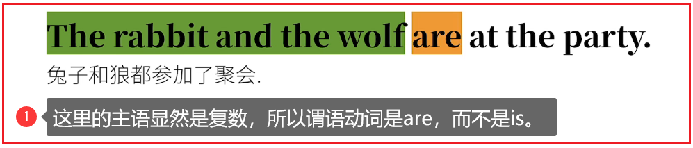
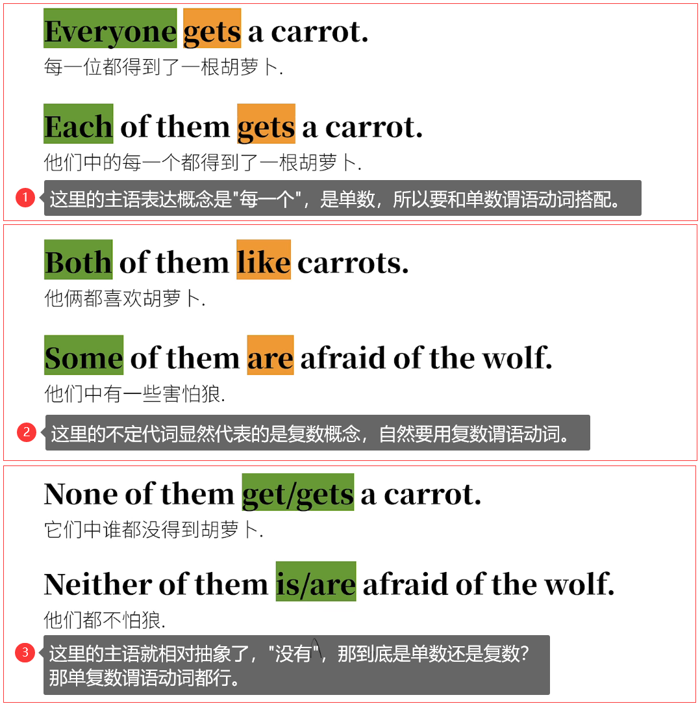

# 9.语法

## 9.1.被动语态（被动句）

### 9.1.1.主动语态和被动语态

<font color=red><strong>英语语态分为两种：主动语态和被动语态</strong></font>

你可能会问，一句话用主动语态就能表达清楚的事儿，为什么还要用被动语态来说呢？

可以想象一下，突然听到有人喊：兔子咬人了！第一反应多半是兔子急了，是兔子，不是别人。**这句话中显然兔子是关注的重点**；
然后第二反应多半是谁被兔子咬了？此时这句话在强调什么呢？可不是兔子了，**而是被兔子咬的谁**。


<font color=red><strong>中文都会用"被"来表达被动，那英文又是如何表达呢？</strong></font>

<font color=red><strong>在语法综述提到的"谓语动词"在句子成分中占据核心地位，其实被动语态的构成也是通过谓语动词的变化完成的。</strong></font>

**通过五种基本句型来看被动语态是怎么演化的。**

### 9.1.2.被动语态的语法

#### 9.1.2.1.被动语态的构成

<font color=red><strong>be + 动词过去分词</strong></font>

#### 9.1.2.2.by + 动作执行者

<font color=red><strong>如果需要表面动作的执行者是谁，那就要借助by + 动词的执行者</strong></font>

### 9.1.3.五种基本句型


#### 9.1.3.1.主 + 谓


<font color=red><strong>这个句子的谓语动词后没有宾语，这是因为slept（原型sleep）是个不及物动词，不存在动作的承受者这个概念，自然就没有被动语态。</strong></font>

#### 9.1.3.2.主 + 谓 + 宾


**很多情况下，无需表明"被谁……"这一概念。**


#### 9.1.3.3.主 + 谓 + 直接宾语 + 间接宾语


#### 9.1.3.4.主 + 谓 + 宾 + 宾补


<font color=red><strong>特别注意：</strong></font>


#### 9.1.3.5.主 + 系 + 表（主语补语）


### 9.1.4.被动态的复杂结构

<font color=red><strong>其实被动语态可以更复杂，如果被动态和时态，语气，情态助动词相结合的话，就会产生一系列"化学反应"。</strong></font>


<font color=red><strong>归根结底，这些"变位"主要是针对构成被动语态所需的be动词的变位，所以也是很有规律的。</strong></font>

## 9.2.主谓一致

### 9.2.1.主谓一致简介

主谓一致又是我们学习的一大难点，为什么这么说？


之所以出现以上情况，这个牵涉到语言的底层逻辑：


<font color=red><strong>也就是说这里主语和谓语动词传递的信息是一致的，即主谓一致。</strong></font>

英语语法的"主谓一致"讲究三大原则


### 9.2.2.语法一致

<font color=red><strong>语法一致就是让句子的谓语动词在形式上和主语的单复数保持一致</strong></font>

#### 9.2.2.1.单数主语/复数主语


<font color=red><strong>非谓语动词作主语时，也相当于单数名词。</strong></font>


<font color=red><strong>一般情况下，用and连接不同的名词做主语，都会接复数谓语动词。</strong></font>



**但是可别一看到and就自动认为一定要接复数动词，后面讲意义一致的时候再细说。**

#### 9.2.2.2.假象主语


**还有些句子很有"欺骗性"，包含了一些特定的短语，如as well as、except、but……，使得主语看起来是复数，但其实是单数，反之亦然。**


<font color=red><strong>有些语法体系称这样的情况为"就远原则"，和后面"就近原则"对应。不管叫什么，这里的关键还是要认清真正的主语。</strong></font>

#### 9.2.2.3.不定代词主语

<font color=red><strong>不定代词作主语时，谓语动词要和不定代词背后的概念保持一致。</strong></font>



### 9.2.3.意义一致

<font color=red><strong>意义一致，就是主语意义为单数，则谓语动词用单数；主语意义为复数，则谓语动词也需要用复数。</strong></font>

#### 9.2.3.1.同一个主语多种身份

<font color=red><strong>之前提到的，有and连接的主语就存在一个主语有多种身份。</strong></font>


#### 9.2.3.2.复数名词的单数意义

<font color=red><strong>有些主语形式看起来是复数，但其实表达的意义是单数。</strong></font>


#### 9.2.3.3.不定代词的单复数意义

<font color=red><strong>当不定代词做主语时，有的时候也要视具体语义来判断到底是复数主语还是单数主语。</strong></font>


#### 9.2.3.4.名词的形和意

<font color=red><strong>英语中的名词往往能通过形式看出单复数，但有的时候也不那么靠谱。</strong></font>

1. 形复意单（用单数谓语动词）

   <font color=red><strong>有些名词看起来是复数，但是意义是单数。</strong></font>

   

2. 形复意复（用复数谓语动词）

   <font color=red><strong>有少数名词，看起来是单数，单数意义是复数。</strong></font>

   

3. 单复数同形名词（用单复数谓语动词都可）

   <font color=red><strong>像sheep这样的词，单复数同形，所以要看主语代表的是单数还是复数意义。</strong></font>

   

   <font color=red><strong>像这样的名词还有deer（鹿），means（方式），series（系列），species（物种）等。</strong></font>

4. 集合名词（用单复数谓语动词都可）

   <font color=red><strong>有些名词既可以代表一个集合（单数意义），也可以代表集合中的全部成员（复数意义）。所以这样的名词做主语，也要视具体情况而论。</strong></font>

   

   **类似的集合名词还有army、audienc、police、team等。**

   不过也有的集合名词只能表示一个类别的事物，只能用单数谓语动词。

   

   <font color=red><strong>the + 形容词</strong></font>

   

   

### 9.2.4.就近一致

<font color=red><strong>就近一致原则是较特殊的存在，它似乎不再遵循语法一致和意义一致。谓语动词的单复数是由最近的主语决定。</strong></font>

#### 9.2.4.1.or、either……or……等


#### 9.2.4.2.There be句型


### 9.2.5.总结


```html
<strong></strong>
<font><strong></strong></font>
<font color=red><strong></strong></font>
<font color=red> </font>
```

